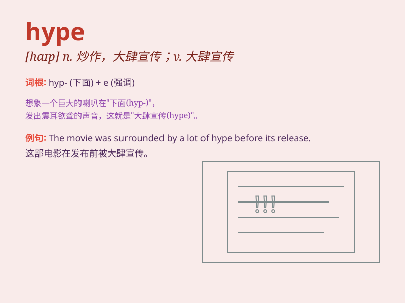

## hype

**英音:** _[haɪp]_ **美音:** _[haɪp]_

**译义:** *n.\<美俚> 皮下注射,骗局,大肆宣传,大做广告,瘾君子*

### 短语

+ **media hype:** _媒体炒作_

+ **hype up:** _使兴奋；使激动；大肆宣传_

+ **hype and hoopla:** _大肆宣传和喧闹_

+ **create hype:** _制造炒作_

+ **commercial hype:** _商业炒作_

### 例句

#### 例句1

> **The new movie was hyped up before its release, but it turned out
to be disappointing.**

**中文翻译:** 新电影上映前曾被炒得沸沸扬扬，但结果却令人失望。

**单词释义:** 大肆宣传；炒作

#### 例句2

> **Don\'t believe all the hype about that diet; it\'s not as
effective as they claim.**

**中文翻译:**
不要相信有关这种饮食的所有宣传；它并不像他们声称的那么有效。

**单词释义:** 夸张的宣传；天花乱坠的广告

#### 例句3

> **The product was just hype and had no real value.**

**中文翻译:** 该产品只是炒作，没有实际价值。

**单词释义:** （无实质内容的）大肆宣传

### 背诵小故事

> A young musician was constantly surrounded by hype. Everyone said he
was the next big star. But he remained calm and focused on his music,
not getting carried away by all the excessive praise and excitement.

**一位年轻的音乐家总是被大肆宣传。每个人都说他是下一个巨星。但他保持冷静，专注于自己的音乐，没有被所有过度的赞扬和兴奋冲昏头脑。**

### 图义

