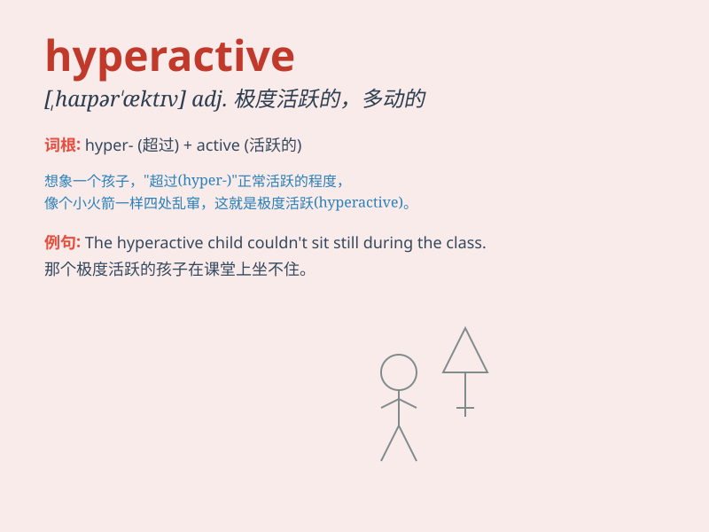

## hyperactive

**英音:** _[haɪpər\'æktɪv]_ **美音:** _[,haɪpɚ\'æktɪv]_

**译义:** *adj.活动过度的,极度活跃的,活动亢进的*

### 短语

+ **hyperactive child:** _过度活跃的孩子_

+ **hyperactive imagination:** _极度活跃的想象力_

+ **hyperactive behavior:** _过度活跃的行为_

+ **hyperactive mind:** _极度活跃的头脑_

+ **hyperactive metabolism:** _亢进的新陈代谢_

### 例句

#### 例句1

> **The hyperactive child couldn\'t sit still for a moment.**

**中文翻译:** 这个多动的孩子一刻也坐不住。

**单词释义:** 极度活跃的

#### 例句2

> **She became hyperactive after drinking too much coffee.**

**中文翻译:** 喝了太多咖啡后，她变得过度活跃。

**单词释义:** 极度活跃的

#### 例句3

> **The hyperactive puppy was running around the house non-stop.**

**中文翻译:** 这只极度活跃的小狗在房子里不停地跑来跑去。

**单词释义:** 极度活跃的

### 背诵小故事

> A little monkey was hyperactive in the zoo. It jumped around
non-stop, climbed trees quickly and couldn\'t stay still for a moment.
Everyone was amazed by its excessive energy.

**一只小猴子在动物园里极度活跃。它不停地跳来跳去，迅速爬上树，一刻也停不下来。大家都对它过度的精力感到惊讶。**

### 图义

