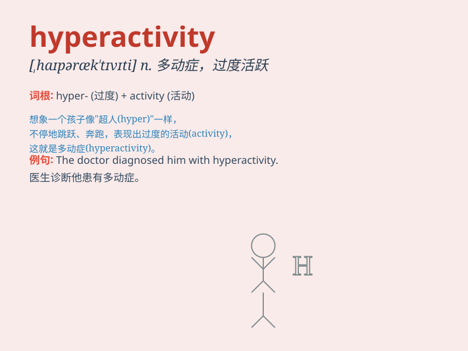

## hyperactivity

**英音:** _[ˌhaɪpəræk\'tɪvəti]_ **美音:**
_[ˌhaɪpəræk\'tɪvəti]_

**译义:** *n.活动过度,极度活跃*

### 短语

+ **attention-deficit/hyperactivity disorder:**
_注意缺陷多动障碍_

+ **childhood hyperactivity:** _儿童多动症_

+ **hyperactivity syndrome:** _多动综合征_

+ **symptoms of hyperactivity:** _多动症状_

+ **diagnosis of hyperactivity:** _多动的诊断_

### 例句

#### 例句1

> **The child\'s hyperactivity made it difficult for him to
concentrate in class.**

**中文翻译:** 孩子的多动症使他在课堂上很难集中注意力。

**单词释义:** 过度活跃

#### 例句2

> **Doctors are studying the causes of hyperactivity in adults.**

**中文翻译:** 医生正在研究成人多动症的原因。

**单词释义:** 过度活跃

#### 例句3

> **His hyperactivity was a sign of underlying stress.**

**中文翻译:** 他的过度活跃是潜在压力的表现。

**单词释义:** 过度活跃

### 背诵小故事

> Once upon a time, there was a little monkey. It had so much energy
and couldn\'t stay still. It was constantly jumping and running around,
showing hyperactivity. This made other animals very tired.

**从前，有一只小猴子。它精力特别旺盛，一刻也停不下来。它不停地跳来跳去，到处跑，表现出过度活跃。这让其他动物都很累。**

### 图义

