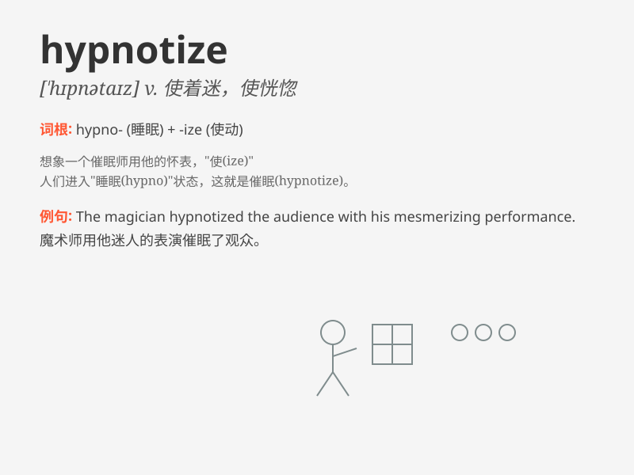

## hypnotize

**英音:** _[\'hɪpnətaɪz]_ **美音:** _[\'hɪpnətaɪz]_

**译义:** *vt.施催眠术,使着迷,使恍惚*

### 短语

+ **hypnotize someone into doing something:**
_通过催眠使某人做某事_

+ **be hypnotized by:** _被\...\...催眠；为\...\...着迷_

+ **hypnotize oneself:** _自我催眠_

+ **power of hypnotize:** _催眠的力量_

+ **hypnotize completely:** _完全催眠_

### 例句

#### 例句1

> **The magician was able to hypnotize the audience with his
tricks.**

**中文翻译:** 魔术师用他的魔术把观众催眠了。

**单词释义:** 使着迷

#### 例句2

> **She was hypnotized by the beauty of the landscape.**

**中文翻译:** 她被美丽的风景迷住了。

**单词释义:** 迷住

#### 例句3

> **The therapist tried to hypnotize the patient to help him overcome
his fear.**

**中文翻译:** 治疗师试图对病人进行催眠，以帮助他克服恐惧。

**单词释义:** 对\...\...施行催眠术

### 背诵小故事

> One day, a magician wanted to show a special trick. He used a shiny
crystal ball to hypnotize the audience. Everyone felt sleepy and their
minds were controlled. That\'s how the power of \'hypnotize\' works.

**有一天，一位魔术师想要展示一个特别的戏法。他用一个闪亮的水晶球来催眠观众。每个人都感到困倦，他们的思想被控制了。这就是'hypnotize'（催眠）的作用方式。**

### 图义

