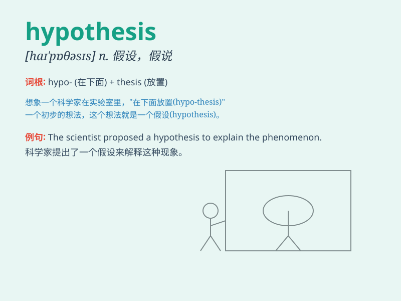

## hypothesis

**英音:** _[haɪ\'pɒθɪsɪs]_ **美音:** _[haɪ\'pɑθəsɪs]_

**译义:** *n.假设*

### 短语

+ **put forward a hypothesis:** _提出一个假设_

+ **test the hypothesis:** _检验假设_

+ **form a hypothesis:** _形成一个假设_

+ **reject the hypothesis:** _拒绝这个假设_

+ **validate the hypothesis:** _验证这个假设_

### 例句

#### 例句1

> **The scientist proposed a new hypothesis to explain the
phenomenon.**

**中文翻译:** 科学家提出了一个新的假设来解释这一现象。

**单词释义:** 假设；假说

#### 例句2

> **We need to test this hypothesis through experiments.**

**中文翻译:** 我们需要通过实验来检验这个假设。

**单词释义:** 假设；假说

#### 例句3

> **His hypothesis was based on insufficient evidence.**

**中文翻译:** 他的假设没有足够的证据。

**单词释义:** 假设；假说

### 背诵小故事

> A scientist had a hypothesis that a new medicine could cure a rare
disease. He spent months testing and observing. Finally, his hypothesis
was proved right. The medicine worked!

**一位科学家有一个假说，即一种新药可以治愈一种罕见疾病。他花了数月进行测试和观察。最终，他的假设被证明是正确的。这种药起作用了！**

### 图义

