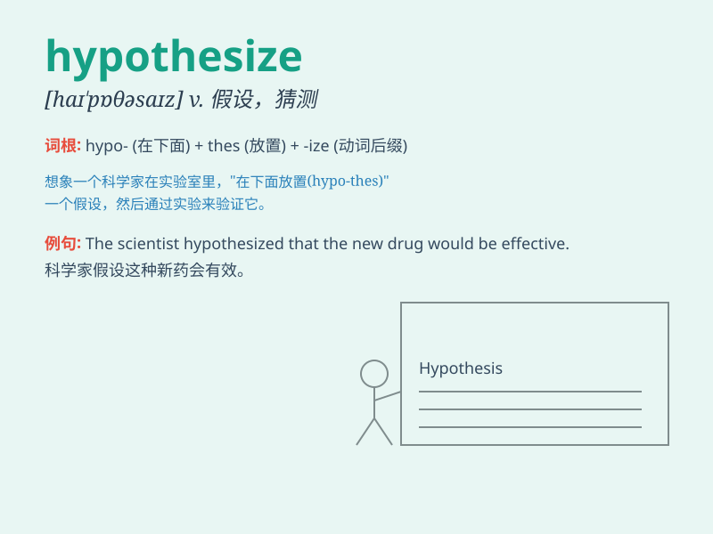

## hypothesize

**英音:** _[haɪ\'pɒθɪsaɪz]_ **美音:** _[haɪ\'pɑθəsaɪz]_

**译义:** *v.假设,假定,猜测*

### 短语

+ **hypothesize about:** _对\...\...进行假设_

+ **hypothesize that:** _假设\...\..._

+ **wildly hypothesize:** _胡乱假设_

+ **randomly hypothesize:** _随意假设_

+ **scientifically hypothesize:** _科学地假设_

### 例句

#### 例句1

> **Scientists hypothesize that there may be life on other
planets.**

**中文翻译:** 科学家推测其他行星上可能存在生命。

**单词释义:** 假设；假定

#### 例句2

> **He hypothesizes that the crime was committed by someone known to
the victim.**

**中文翻译:** 他推测犯罪者是受害人认识的人。

**单词释义:** 假设；假定

#### 例句3

> **We can only hypothesize about what happened in the past.**

**中文翻译:** 我们只能对过去发生的事情进行假设。

**单词释义:** 假设；假定

### 背诵小故事

> A scientist was constantly observing strange phenomena. He couldn\'t
explain them with existing theories, so he had to hypothesize new ideas.
Through experiments and research, he gradually proved his hypothesis.

**一位科学家不断观察到奇怪的现象。他无法用现有的理论来解释，所以他不得不假设新的想法。通过实验和研究，他逐渐证明了他的假设。**

### 图义

