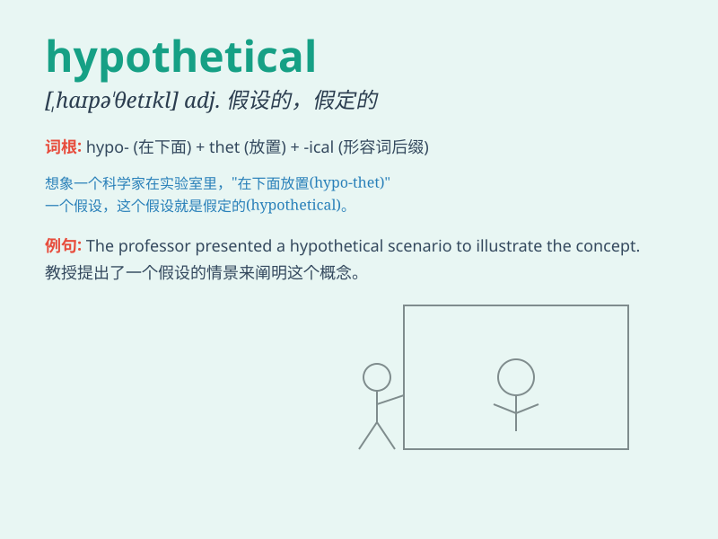

## hypothetical

**英音:** _[,haɪpə\'θetɪk(ə)l]_ **美音:**
_[,haɪpə\'θɛtɪkl]_

**译义:** *adj.假设的,假定的,爱猜想的*

### 短语

+ **hypothetical example:** _假设的例子_

+ **hypothetical situation:** _假设的情况_

+ **hypothetical question:** _假设性问题_

+ **hypothetical reasoning:** _假设推理_

+ **hypothetical model:** _假设模型_

### 例句

#### 例句1

> **Let\'s consider a hypothetical situation where all cars run on
solar power.**

**中文翻译:** 让我们考虑一个假设的情况，所有汽车都使用太阳能。

**单词释义:** 假设的

#### 例句2

> **This is just a hypothetical question, but how would you react if
you won the lottery?**

**中文翻译:** 这只是一个假设问题，但如果你中了彩票，你会如何反应？

**单词释义:** 假设性的

#### 例句3

> **The scientist proposed a hypothetical model to explain the
phenomenon.**

**中文翻译:** 科学家提出了一个假设模型来解释这一现象。

**单词释义:** 假设的

### 背诵小故事

> Imagine a scientist creating a hypothetical creature that could fly
and breathe underwater. But it\'s all just in the mind, not real.
Hypothetical means based on guess or supposition.

**想象一位科学家创造出一种假设的生物，既能飞又能在水下呼吸。但这都只是在想象中，并非真实的。Hypothetical
意思是基于猜测或假定的。**

### 图义

