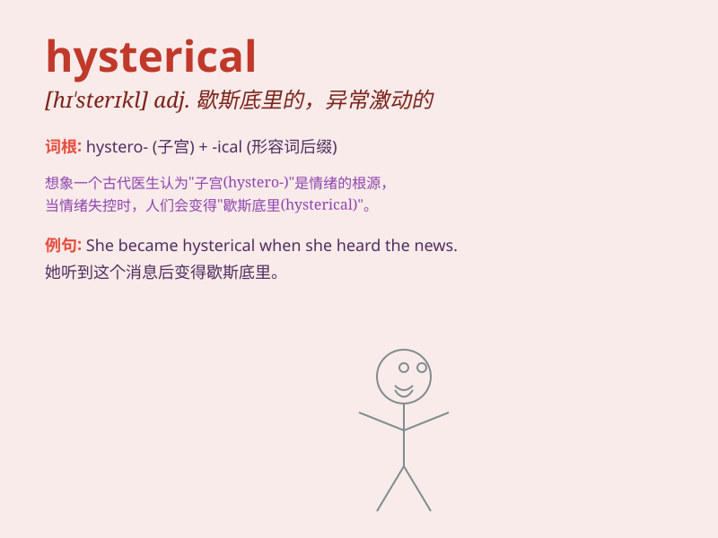

## hysterical

**英音:** _[hɪ\'sterɪk(ə)l]_ **美音:** _[hɪ\'stɛrɪkl]_

**译义:** * a歇斯底里的,异常兴奋的*

### 短语

+ **hysterical laughter:** _歇斯底里的大笑_

+ **hysterical reaction:** _歇斯底里的反应_

+ **hysterical crying:** _歇斯底里的哭泣_

+ **hysterical outburst:** _歇斯底里的爆发_

+ **hysterical fit:** _歇斯底里的发作_

### 例句

#### 例句1

> **She became hysterical when she heard the news.**

**中文翻译:** 当她听到这个消息时，她变得歇斯底里。

**单词释义:** 歇斯底里的

#### 例句2

> **The audience was in a hysterical state after the comedian\'s
performance.**

**中文翻译:** 喜剧演员表演完后，观众们陷入了歇斯底里的状态。

**单词释义:** 情绪失控的

#### 例句3

> **His hysterical laughter filled the room.**

**中文翻译:** 他歇斯底里的笑声充满了整个房间。

**单词释义:** 失控的，疯狂的

### 背诵小故事

> A girl was at a horror movie. The scary scenes made her so frightened
that she became hysterical, laughing and crying uncontrollably. People
around had to calm her down.

**一个女孩在看恐怖电影。恐怖的场景把她吓得歇斯底里，失控地又笑又哭。周围的人不得不让她平静下来。**

### 图义

