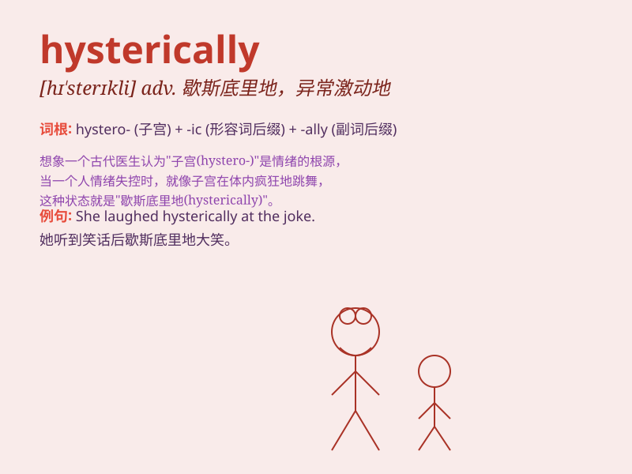

## hysterically

**英音:** _[hɪ\'sterɪkli]_ **美音:** _[hɪ\'sterɪkli]_

**译义:** *adv.歇斯底里地*

### 短语

+ **laugh hysterically:** _歇斯底里地大笑_

+ **cry hysterically:** _歇斯底里地哭_

+ **scream hysterically:** _歇斯底里地尖叫_

+ **react hysterically:** _歇斯底里地反应_

+ **behave hysterically:** _举止歇斯底里_

### 例句

#### 例句1

> **She laughed hysterically when she heard the joke.**

**中文翻译:** 当她听到这个笑话时，她歇斯底里地笑了。

**单词释义:** 歇斯底里地

#### 例句2

> **He cried hysterically at the funeral.**

**中文翻译:** 他在葬礼上歇斯底里地哭泣。

**单词释义:** 歇斯底里地

#### 例句3

> **The crowd cheered hysterically as the team won the
championship.**

**中文翻译:** 当球队赢得冠军时，全场观众爆发出歇斯底里的欢呼声。

**单词释义:** 歇斯底里地

### 背诵小故事

> A girl was watching a horror movie. When the most terrifying scene
came, she laughed hysterically. Everyone was confused. Later she
explained she was so scared that she reacted in an odd way.

**一个女孩正在看恐怖电影。当最恐怖的场景出现时，她歇斯底里地大笑。每个人都很困惑。后来她解释说她太害怕了，所以反应很奇怪。**

### 图义

