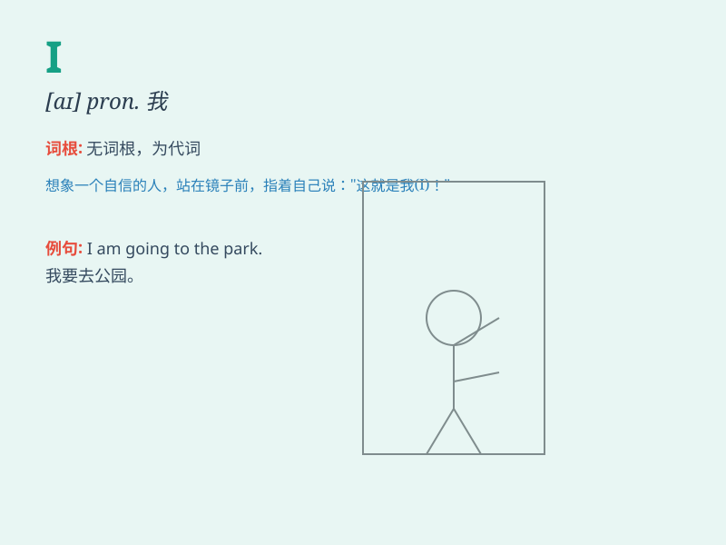

## I

**英音:** _[aɪ]_ **美音:** _[aɪ]_

**译义:** *pron. 我（主格）；我自己*

### 短语

+ **I think:** _我认为_

+ **I hope:** _我希望_

+ **I know:** _我知道_

+ **I see:** _我明白；我懂_

+ **I guess:** _我猜；我想_

### 例句

#### 例句1

> **I am a student.**

**中文翻译:** 我是一名学生。

**单词释义:** 我

#### 例句2

> **I love reading books.**

**中文翻译:** 我喜欢读书。

**单词释义:** 我

#### 例句3

> **I have a dream.**

**中文翻译:** 我有一个梦想。

**单词释义:** 我

### 背诵小故事

>
想象一下，你站在镜子前，看到的那个独一无二的自己，那就是'I'。'I'代表着你，是自我的象征。当你勇敢表达想法时，开头就是'I
think\...'，因为你是独特且重要的存在。

**想象一下，你站在镜子前，看到的那个独一无二的自己，那就是"我"。"我"代表着你，是自我的象征。当你勇敢表达想法时，开头就是"我认为\...\..."，因为你是独特且重要的存在。**

### 图义

