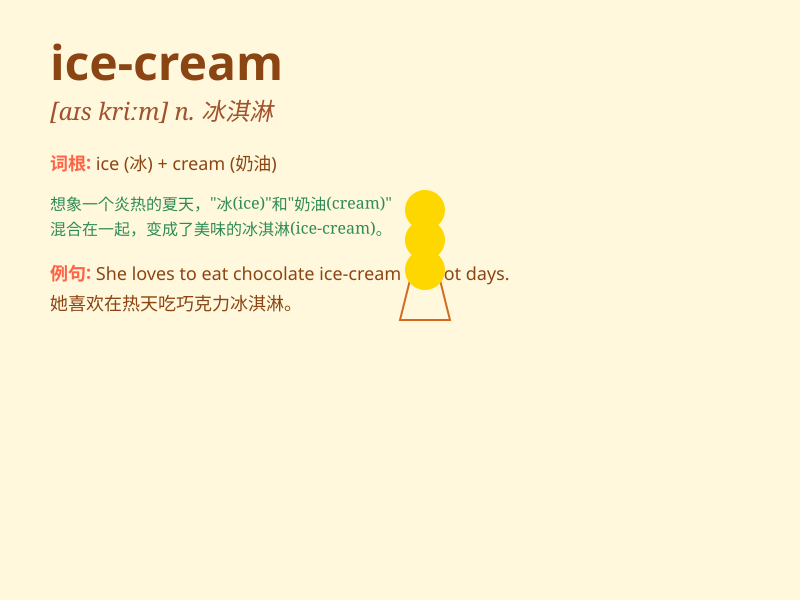

## ice-cream

**英音:** _[ˈaɪs kriːm]_ **美音:** _[ˈaɪs kriːm]_

**译义:** *n.冰淇淋*

### 短语

+ **ice-cream cone:** _冰淇淋蛋筒_

+ **ice-cream sundae:** _冰淇淋圣代_

+ **chocolate ice-cream:** _巧克力冰淇淋_

+ **vanilla ice-cream:** _香草冰淇淋_

+ **strawberry ice-cream:** _草莓冰淇淋_

### 例句

#### 例句1

> **I love eating ice-cream on a hot summer day.**

**中文翻译:** 我喜欢在炎热的夏日吃冰淇淋。

**单词释义:** 冰淇淋

#### 例句2

> **She bought a cone of ice-cream at the store.**

**中文翻译:** 她在商店买了一个甜筒冰淇淋。

**单词释义:** 冰淇淋

#### 例句3

> **The kids were excited to get ice-cream as a treat.**

**中文翻译:** 孩子们因为能得到冰淇淋作为款待而兴奋。

**单词释义:** 冰淇淋

### 背诵小故事

> One hot summer day, I was sweating a lot. Then I saw an ice-cream
truck. I bought an ice-cream. The cold and sweet taste made me feel so
happy and refreshed.

**在一个炎热的夏日，我汗流浃背。然后我看到一辆冰淇淋车。我买了一个冰淇淋。那冰凉又甜蜜的味道让我感到非常开心和神清气爽。**

### 图义

