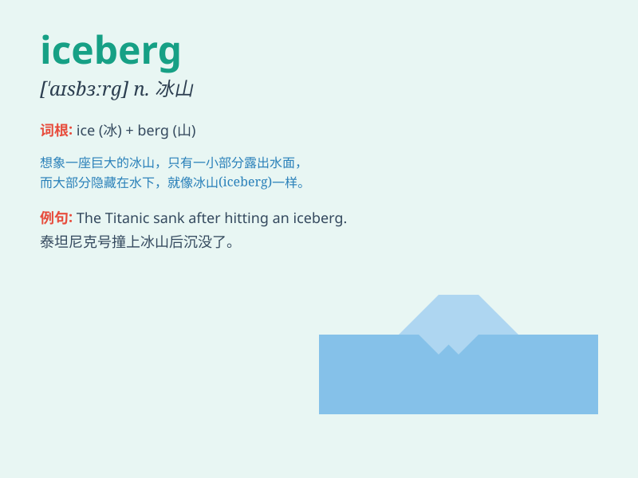

## iceberg

**英音:** _[\'aɪsbɜːg]_ **美音:** _[\'aɪs\'bɝg]_

**译义:** *n.冰山,冷冰冰的人*

### 短语

+ **tip of the iceberg:** _冰山一角；事物的表面部分_

+ **iceberg lettuce:** _卷心莴苣；生菜_

+ **iceberg principle:** _冰山原则（指只表现事物的一小部分）_

+ **huge iceberg:** _巨大的冰山_

+ **floating iceberg:** _漂浮的冰山_

### 例句

#### 例句1

> **The Titanic hit an iceberg and sank.**

**中文翻译:** 泰坦尼克号撞上冰山并沉没。

**单词释义:** 冰山

#### 例句2

> **Only the tip of the iceberg shows; most of its mass is
underwater.**

**中文翻译:** 所显示的只是冰山一角；它的大部分质量都在水下。

**单词释义:** 冰山

#### 例句3

> **The exploration team discovered a huge iceberg in the polar
region.**

**中文翻译:** 探险队在极地发现了一座巨大的冰山。

**单词释义:** 冰山

### 背诵小故事

> A ship was sailing on the sea. Suddenly, it hit something. It was an
iceberg! Only the tip was visible above the water. The hidden part
beneath was huge and dangerous.

**一艘船在海上航行。突然，它撞到了什么东西。原来是一座冰山！只有顶端在水面上可见。水下隐藏的部分巨大且危险。**

### 图义

