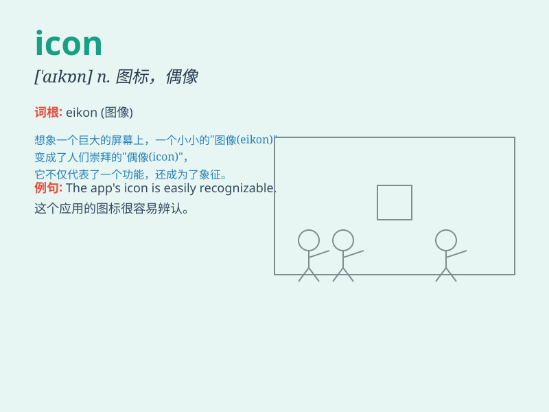

## icon

**英音:** _[\'aɪkɒn; -k(ə)n]_ **美音:** _[\'aɪkɑn]_

**译义:** *n.图标,肖像,偶像*

### 短语

+ **cultural icon:** _文化偶像_

+ **fashion icon:** _时尚偶像_

+ **pop icon:** _流行偶像_

+ **iconic image:** _标志性形象_

+ **iconic building:** _标志性建筑_

### 例句

#### 例句1

> **The icon on the computer screen indicates a new message.**

**中文翻译:** 计算机屏幕上的图标表示有新消息。

**单词释义:** 图标

#### 例句2

> **She has become an icon of fashion.**

**中文翻译:** 她已成为时尚界的偶像。

**单词释义:** 偶像

#### 例句3

> **The religious icon was highly revered by the believers.**

**中文翻译:** 宗教圣像受到信徒的高度崇敬。

**单词释义:** 圣像

### 背诵小故事

>
想象一下，在一个古老的城堡里，有一扇神秘的门，门上有一个独特的符号（icon），它闪耀着光芒，指引着人们找到隐藏的宝藏。这个符号就是关键，代表着希望和财富。

**想象在古老城堡里，门上独特的代表希望和财富、指引找到宝藏的关键符号就是【icon（图标；象征）】**

### 图义

