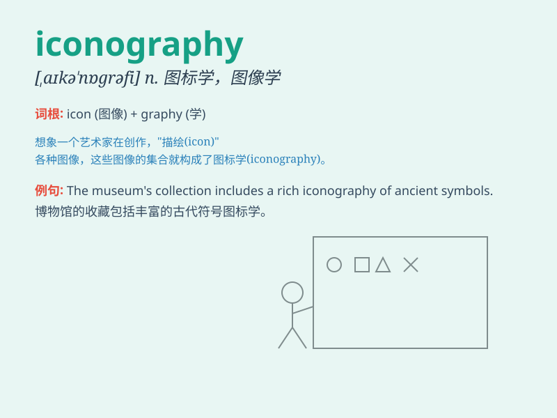

## iconography

**英音:** _[,aɪkə\'nɒgrəfɪ]_ **美音:**
_[\'aɪkə\'nɑgrəfi]_

**译义:** *n.肖像学,肖像画法*

### 短语

+ **religious iconography:** _宗教图像学_

+ **pop iconography:** _流行图像学_

+ **visual iconography:** _视觉图像学_

+ **ancient iconography:** _古代图像学_

+ **cultural iconography:** _文化图像学_

### 例句

#### 例句1

> **The iconography of this ancient temple is highly complex and
fascinating.**

**中文翻译:** 这座古老寺庙的图像非常复杂且令人着迷。

**单词释义:** 图像学；肖像研究

#### 例句2

> **The study of iconography helps us understand the cultural and
religious significance of various symbols.**

**中文翻译:** 图像学的研究有助于我们理解各种符号的文化和宗教意义。

**单词释义:** 图像学；肖像研究

#### 例句3

> **The iconography in her paintings reflects her unique style and
perspective.**

**中文翻译:** 她画作中的图像反映了她独特的风格和视角。

**单词释义:** 图像学；肖像研究

### 背诵小故事

> A young artist was obsessed with iconography. He spent days studying
ancient icons and their meanings. One day, he had a dream where the
icons came alive and taught him their secrets. When he woke up, he
understood iconography perfectly.

**一位年轻的艺术家痴迷于图像学。他花了好几天研究古代的图像及其含义。有一天，他做了一个梦，图像都活了过来，并向他传授了它们的秘密。当他醒来时，他完全理解了图像学。**

### 图义

