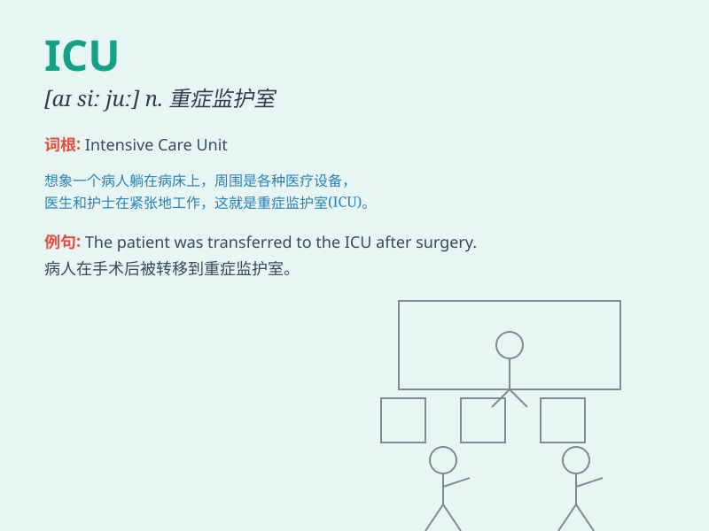

## ICU

**英音:** _[ˈɪ.kjuː]_ **美音:** _[ˈɪ.kjuː]_

**译义:** *n.重症监护病房（Intensive Care Unit的缩写）*

### 短语

+ **ICU patient:** _重症监护病房的病人_

+ **ICU nurse:** _重症监护病房的护士_

+ **ICU doctor:** _重症监护病房的医生_

+ **admit to ICU:** _送入重症监护病房_

+ **transfer from ICU:** _从重症监护病房转出_

### 例句

#### 例句1

> **He was transferred to the ICU after the accident.**

**中文翻译:** 事故发生后，他被转到了重症监护室。

**单词释义:** 重症监护室

#### 例句2

> **The patient\'s condition deteriorated rapidly and was admitted to
the ICU.**

**中文翻译:** 病人的病情迅速恶化，被送进了重症监护室。

**单词释义:** 重症监护室

#### 例句3

> **Doctors are closely monitoring the patients in the ICU.**

**中文翻译:** 医生们正在密切监测重症监护室里的病人。

**单词释义:** 重症监护室

### 背诵小故事

>
想象一下，有个病人病情危急被送进了医院的一个特殊区域，这里的医护人员时刻紧张忙碌。这个区域就是\'ICU\'，即\'Intensive
Care Unit\'，意思是重症监护室。

**想象病人被送进医院特殊区域，这里是\'ICU\'，即\'重症监护室\'，医护人员紧张忙碌。**

### 图义

