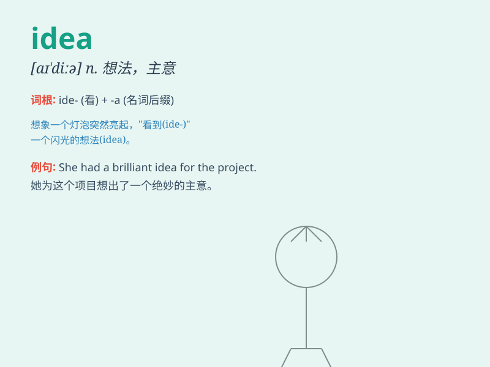

## idea

**英音:** _[aɪ\'dɪə]_ **美音:** _[aɪ\'diə]_

**译义:** *n.想法,念头,意见,主意,思想,观念,概念*

### 短语

+ **good idea:** _好主意_

+ **new idea:** _新想法_

+ **have no idea:** _不知道；毫无头绪_

+ **brilliant idea:** _绝妙的主意_

+ **original idea:** _原创想法_

### 例句

#### 例句1

> **I have an idea for a new project.**

**中文翻译:** 我有一个新项目的想法。

**单词释义:** 想法；主意

#### 例句2

> **His idea of a vacation is staying at home and reading.**

**中文翻译:** 他对假期的想法是呆在家里读书。

**单词释义:** 想法；概念

#### 例句3

> **The idea that we can solve this problem easily is wrong.**

**中文翻译:** 我们可以轻松解决这个问题的想法是错误的。

**单词释义:** 想法；念头

### 背诵小故事

> One day, a little boy was lost in a forest. He had no idea how to
find his way home. Just when he was about to cry, he saw a bright light
and followed it. It led him back home. The light was like a great idea
that saved him.

**有一天，一个小男孩在森林里迷路了。他不知道怎么找到回家的路。就在他快要哭的时候，他看到了一束亮光并跟着它。这束光带他回了家。这束光就像一个很棒的主意拯救了他。**

### 图义

