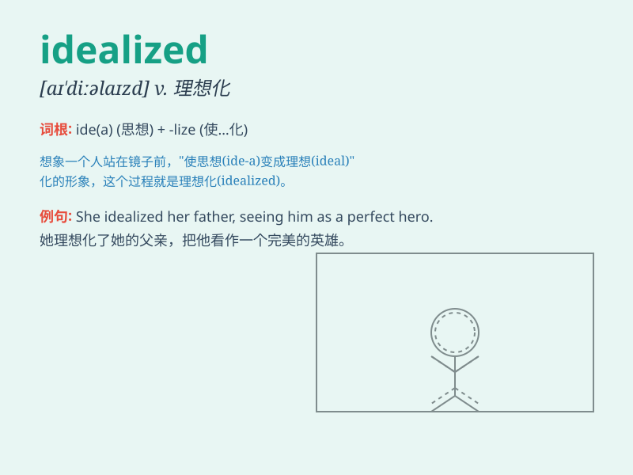

## idealized

**英音:** _[ˌɪ.dɪˈə.laɪzd]_ **美音:** _[ˌɪ.dəˈlaɪ.zd]_

**译义:** *adj. 理想化的；理想主义的（过去分词）*

### 短语

+ **idealized image:** _理想化的形象_

+ **idealized version:** _理想化的版本_

+ **idealized concept:** _理想化的概念_

+ **idealized world:** _理想化的世界_

+ **idealized situation:** _理想化的情况_

### 例句

#### 例句1

> **The artist presented an idealized portrait of nature, filled with
vibrant colors and perfect forms.**

**中文翻译:**
这位艺术家呈现了一幅理想化的自然画像，充满了鲜艳的色彩和完美的形式。

**单词释义:** 理想化的

#### 例句2

> **She has an idealized view of marriage, expecting it to be all
romance and no challenges.**

**中文翻译:** 她对婚姻有一种理想化的看法，期望它全是浪漫，没有挑战。

**单词释义:** 理想化的

#### 例句3

> **The novel depicts an idealized society where everyone is happy
and fulfilled.**

**中文翻译:**
这部小说描绘了一个理想化的社会，在那里每个人都快乐和满足。

**单词释义:** 理想化的

### 背诵小故事

> A young artist had an idealized vision of a perfect garden. He
imagined colorful flowers, clear fountains, and peaceful benches. This
vision was so idealized that it was almost like a dream. But it inspired
him to create beautiful art.

**一位年轻的艺术家对一个完美的花园有着理想化的想象。他想象着五颜六色的花朵、清澈的喷泉和平静的长椅。这种想象是如此理想化，几乎像一场梦。但它激励他创作出美丽的艺术作品。**

### 图义

