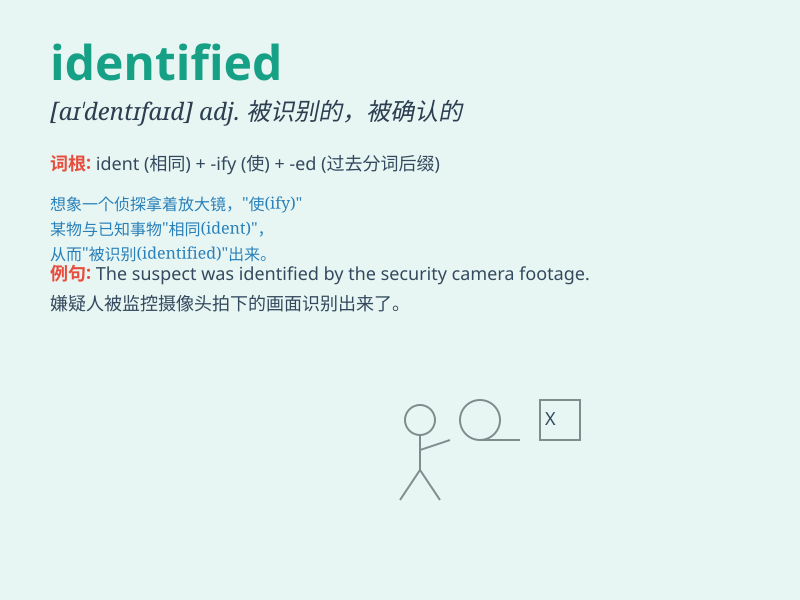

## identified

**英音:** _[aɪˈdentɪfaɪd]_ **美音:** _[aɪˈdentɪfaɪd]_

**译义:** *v. 确认；认出；鉴定；找到；显示；说明身份（identify
的过去式和过去分词）*

### 短语

+ **identified as:** _被认定为；被确认为_

+ **identified with:** _认同；与\...\...有同感_

+ **be identified clearly:** _被清晰地识别_

+ **identified target:** _已识别的目标_

+ **identified problem:** _已确定的问题_

### 例句

#### 例句1

> **The police identified the suspect from the CCTV footage.**

**中文翻译:** 警方通过监控录像确认了嫌疑人。

**单词释义:** 确认；认出

#### 例句2

> **Scientists have identified a new species of bird.**

**中文翻译:** 科学家们已经鉴定出了一种新的鸟类。

**单词释义:** 鉴定；识别

#### 例句3

> **The problem has been identified, but the solution is not yet
clear.**

**中文翻译:** 问题已经被查明，但解决方案还不清楚。

**单词释义:** 查明；找出

### 背诵小故事

> One day, a detective was working on a case. He carefully examined the
clues and finally identified the criminal. It was a thrilling moment as
he successfully pointed out the culprit.

**有一天，一位侦探在处理一个案件。他仔细检查线索，最终确认了罪犯。当他成功指出罪犯时，这是一个激动人心的时刻。**

### 图义

