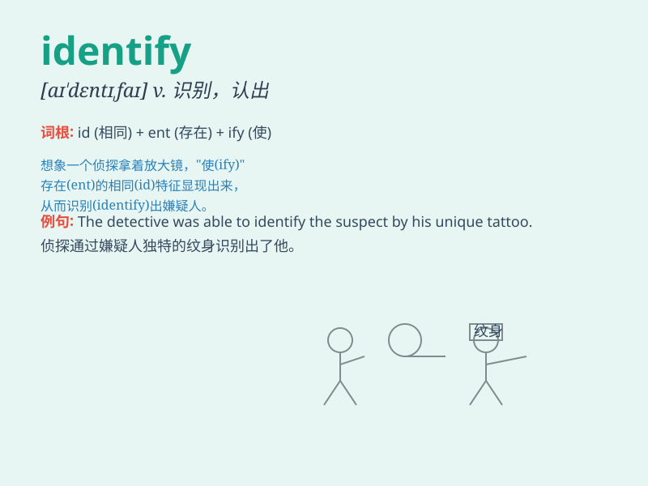

## identify

**英音:** _[aɪ\'dentɪfaɪ]_ **美音:** _[aɪ\'dɛntɪfaɪ]_

**译义:** *vt.识别,鉴别,把\...和\...看成一样v.确定*

### 短语

+ **identify with:** _认同；与......有同感_

+ **identify oneself:** _表明身份；自我介绍_

+ **identify as:** _认定为；确认为_

+ **identify the problem:** _找出问题；识别问题_

+ **identify the cause:** _找出原因；查明原因_

### 例句

#### 例句1

> **The police were able to identify the thief from the security
camera footage.**

**中文翻译:** 警方通过监控录像确认了小偷的身份。

**单词释义:** 认出；识别

#### 例句2

> **She identified the problem and came up with a solution
quickly.**

**中文翻译:** 她发现了问题并很快想出了解决方案。

**单词释义:** 发现；确定

#### 例句3

> **It\'s important to identify your strengths and weaknesses.**

**中文翻译:** 确定自己的优势和劣势很重要。

**单词释义:** 确定；明确

### 背诵小故事

> One day, a detective was trying to solve a mystery. He needed to
identify the criminal. He carefully examined clues and finally found the
key evidence to identify the culprit.

**一天，一位侦探试图解开一个谜团。他需要辨认出罪犯。他仔细检查线索，最终找到了关键证据来确认罪犯。**

### 图义

