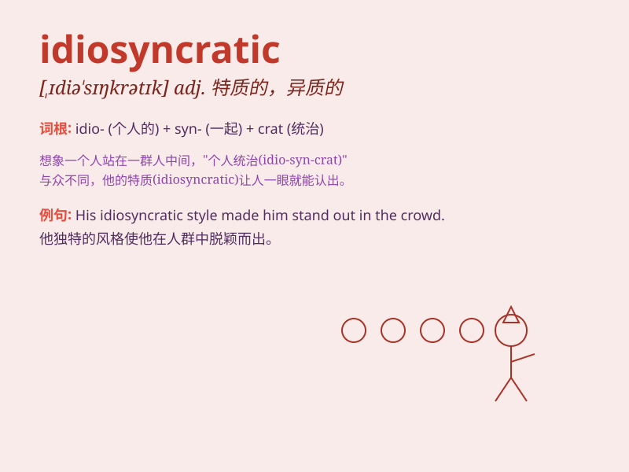

## idiosyncratic

**英音:** _[,ɪdɪə(ʊ)sɪŋ\'krætɪk]_ **美音:**
_[,ɪdɪəsɪŋ\'krætɪk]_

**译义:** *adj.特殊物质的,特殊的,异质的*

### 短语

+ **idiosyncratic behavior:** _特殊的行为_

+ **idiosyncratic style:** _独特的风格_

+ **idiosyncratic trait:** _特异的特质_

+ **idiosyncratic feature:** _独特的特征_

+ **idiosyncratic preference:** _特殊的偏好_

### 例句

#### 例句1

> **His idiosyncratic style of painting sets him apart from other
artists.**

**中文翻译:** 他独特的绘画风格使他有别于其他艺术家。

**单词释义:** 独特的；与众不同的

#### 例句2

> **The restaurant has an idiosyncratic menu that changes daily.**

**中文翻译:** 餐厅提供每日更换的独特菜单。

**单词释义:** 独特的；与众不同的

#### 例句3

> **Her idiosyncratic behavior often puzzles her colleagues.**

**中文翻译:** 她的怪异行为经常让她的同事感到困惑。

**单词释义:** 特有的；特殊的

### 背诵小故事

> A strange artist had very idiosyncratic ways. He always painted at
midnight and used only purple. This odd behavior showed his
idiosyncratic style.

**一位奇怪的艺术家有着非常独特的方式。他总是在午夜作画，而且只用紫色。这种古怪的行为展现了他独特的风格。**

### 图义

