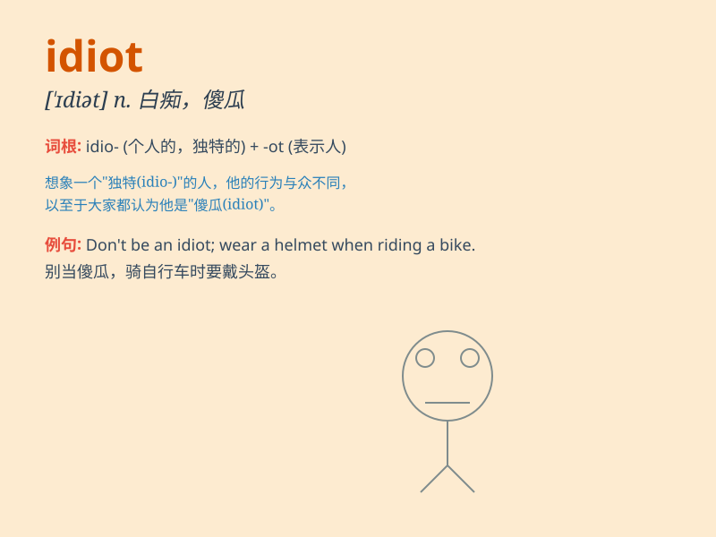

## idiot

**英音:** _[\'ɪdɪət]_ **美音:** _[\'ɪdɪət]_

**译义:** *n.白痴,愚人,傻瓜*

### 短语

+ **idiot box:** _电视机_

+ **idiot light:** _（汽车仪表板上的）傻瓜指示灯_

+ **act the idiot:** _装疯卖傻_

+ **born idiot:** _天生的白痴_

+ **complete idiot:** _十足的白痴_

### 例句

#### 例句1

> **Don\'t be such an idiot!**

**中文翻译:** 别这么白痴！

**单词释义:** 笨蛋；傻瓜

#### 例句2

> **He\'s a complete idiot when it comes to money.**

**中文翻译:** 在金钱的问题上他就是个彻头彻尾的白痴。

**单词释义:** 白痴

#### 例句3

> **You idiot! You\'ve lost my keys.**

**中文翻译:** 你这个白痴！你弄丢了我的钥匙。

**单词释义:** 蠢货

### 背诵小故事

> Once upon a time, there was a man who always made the silliest
decisions. He couldn\'t understand simple tasks and often caused
trouble. Everyone called him an idiot. He never learned and continued to
act foolishly.

**从前，有一个人总是做最愚蠢的决定。他理解不了简单的任务，还经常惹麻烦。大家都叫他白痴。他从不吸取教训，继续愚蠢行事。**

### 图义

