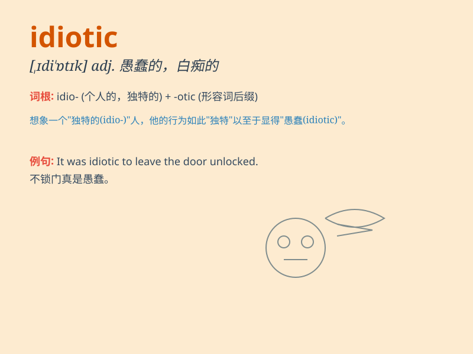

## idiotic

**英音:** _[ɪdɪ\'ɒtɪk]_ **美音:** _[\'ɪdɪ\'ɑtɪk]_

**译义:** *adj.白痴般的*

### 短语

+ **idiotic behavior:** _愚蠢的行为_

+ **idiotic mistake:** _白痴般的错误_

+ **idiotic idea:** _荒唐的想法_

+ **idiotic grin:** _傻里傻气的咧嘴笑_

+ **idiotic comment:** _愚蠢的评论_

### 例句

#### 例句1

> **His idiotic behavior at the party made everyone
uncomfortable.**

**中文翻译:** 他在聚会上的愚蠢行为让每个人都感到不舒服。

**单词释义:** 愚蠢的

#### 例句2

> **It was an idiotic decision to go hiking without proper
equipment.**

**中文翻译:** 在没有适当装备的情况下徒步旅行是一个愚蠢的决定。

**单词释义:** 愚蠢的

#### 例句3

> **Don\'t listen to his idiotic suggestions; they will lead you
astray.**

**中文翻译:** 不要听他的愚蠢建议；他们会让你误入歧途。

**单词释义:** 愚蠢的

### 背诵小故事

> A man was walking in the street, wearing a funny hat and singing
loudly. His behavior was so strange and unreasonable. People around him
thought he was idiotic. Later, he realized his mistake and changed his
ways.

**一个男人走在街上，戴着滑稽的帽子大声唱歌。他的行为如此奇怪和不合理。周围的人都认为他愚蠢至极。后来，他意识到了自己的错误并改变了做法。**

### 图义

