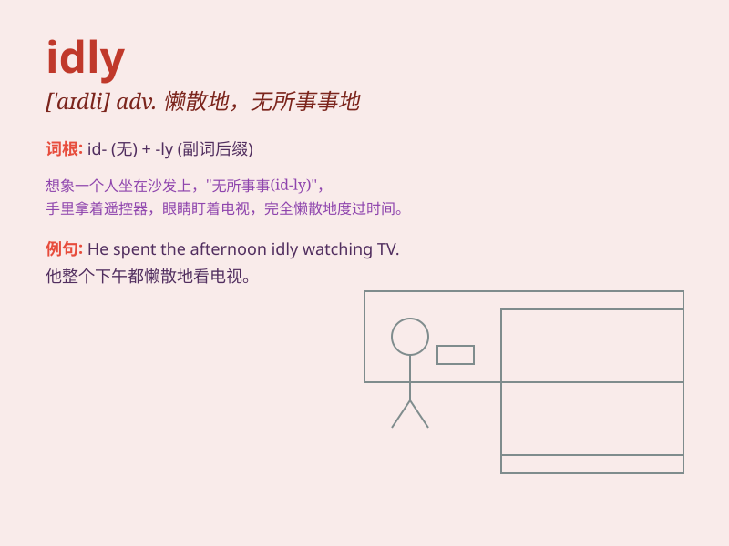

## idly

**英音:** _[\'aɪdlɪ]_ **美音:** _[\'aɪdli]_

**译义:** *adv.懒惰地,空闲地*

### 短语

+ **idly chatting:** _漫不经心地聊天_

+ **idly waiting:** _无所事事地等待_

+ **idly standing:** _懒散地站着_

+ **idly sitting:** _悠闲地坐着_

+ **idly daydreaming:** _心不在焉地做白日梦_

### 例句

#### 例句1

> **He was idly flipping through a magazine.**

**中文翻译:** 他正悠闲地翻着一本杂志。

**单词释义:** 漫不经心地

#### 例句2

> **She idly watched the clouds float by.**

**中文翻译:** 她悠闲地看着云朵飘过。

**单词释义:** 无所事事地

#### 例句3

> **They idly chatted about the weather.**

**中文翻译:** 他们闲聊着天气。

**单词释义:** 闲聊地

### 背诵小故事

> One day, Tom was sitting idly by the window, doing nothing. Just
then, a bird flew by and reminded him that idleness leads to no
progress. So, he decided to get up and do something meaningful.

**一天，汤姆无所事事地坐在窗边。就在这时，一只鸟飞过，提醒他游手好闲不会有进步。于是，他决定起身去做些有意义的事。**

### 图义

