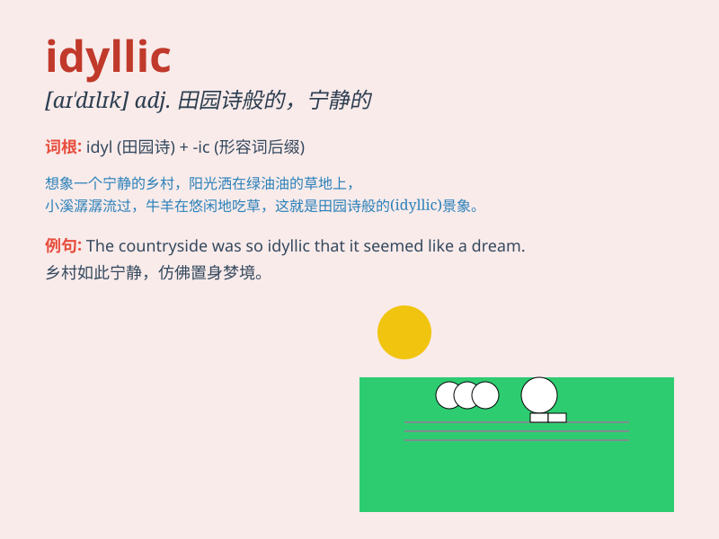

## idyllic

**英音:** _[ɪ\'dɪlɪk]_ **美音:** _[aɪ\'dɪlɪk]_

**译义:** *adj.田园短诗的,牧歌的,生动逼真的*

### 短语

+ **idyllic scene:** _田园风光；田园美景_

+ **idyllic life:** _田园生活；闲适的生活_

+ **idyllic setting:** _田园般的环境；田园式背景_

+ **idyllic village:** _田园村庄；宁静的村庄_

+ **idyllic countryside:** _田园乡村；美丽的乡村_

### 例句

#### 例句1

> **We spent an idyllic weekend in the countryside.**

**中文翻译:** 我们在乡村度过了一个田园诗般的周末。

**单词释义:** 田园诗般的；平和美丽的

#### 例句2

> **The small island has an idyllic beach.**

**中文翻译:** 这个小岛有一个田园诗般的海滩。

**单词释义:** 田园诗般的；充满诗情画意的

#### 例句3

> **Their life in the mountains was idyllic.**

**中文翻译:** 他们在山里的生活是田园诗般的。

**单词释义:** 平和美丽的；宁静宜人的

### 背诵小故事

> A young artist traveled to a remote village. There, he found an
idyllic scene: clear rivers, green meadows, and friendly villagers. The
peaceful and charming place inspired his best paintings.

**一位年轻的艺术家去了一个偏远的村庄。在那里，他发现了一幅田园诗般的景象：清澈的河流、绿色的草地和友好的村民。这个宁静迷人的地方激发了他最出色的画作。**

### 图义

