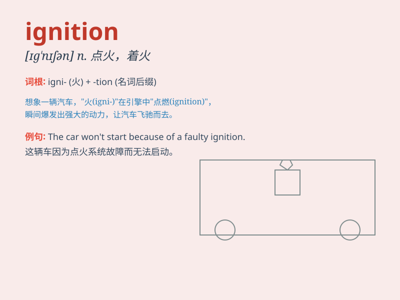

## ignition

**英音:** _[ɪg\'nɪʃ(ə)n]_ **美音:** _[ɪɡ\'nɪʃən]_

**译义:** *n.点火,点燃*

### 短语

+ **ignition switch:** _点火开关_

+ **ignition system:** _点火系统_

+ **ignition coil:** _点火线圈_

+ **ignition key:** _点火钥匙_

+ **ignition point:** _燃点；着火点_

### 例句

#### 例句1

> **The ignition of the car failed. **

**中文翻译:** 汽车点火失败。

**单词释义:** 点火；点燃

#### 例句2

> **He turned the key in the ignition to start the engine. **

**中文翻译:** 他转动点火钥匙启动发动机。

**单词释义:** 点火装置

#### 例句3

> **The ignition system needs to be checked. **

**中文翻译:** 需要检查点火系统。

**单词释义:** 点火系统

### 背诵小故事

> A car thief broke into a car but couldn\'t start it because he
didn\'t know the key to the ignition. Just then, the police arrived and
caught him. The ignition is the system that starts the engine.

**一个偷车贼闯入一辆车但无法启动，因为他不知道点火装置的钥匙。就在这时，警察赶到并抓住了他。ignition
指的是启动引擎的系统。**

### 图义

