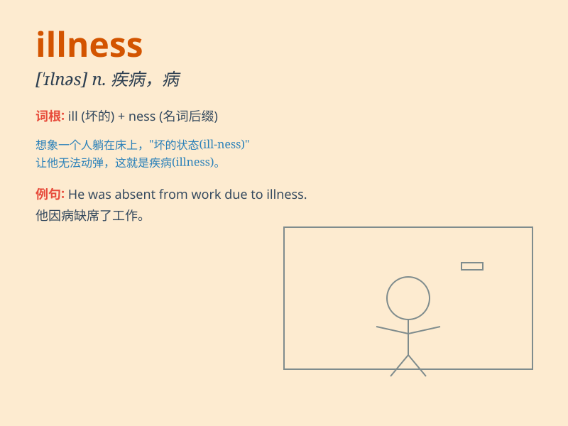

## illness

**英音:** _[ˈɪlnəs]_ **美音:** _[\'ɪlnəs]_

**译义:** *n.疾病,生病*

### 短语

+ **serious illness:** _严重的疾病_

+ **chronic illness:** _慢性疾病_

+ **mental illness:** _精神疾病_

+ **terminal illness:** _绝症；晚期疾病_

+ **infectious illness:** _传染性疾病_

### 例句

#### 例句1

> **She has been suffering from a serious illness for months.**

**中文翻译:** 她已经患了一种严重的疾病好几个月了。

**单词释义:** 疾病

#### 例句2

> **The doctor diagnosed his illness as pneumonia.**

**中文翻译:** 医生诊断他的病为肺炎。

**单词释义:** 疾病

#### 例句3

> **Illness prevented him from attending the meeting.**

**中文翻译:** 疾病使他无法参加会议。

**单词释义:** 疾病

### 背诵小故事

> One day, Tom felt very weak and had a high fever. The doctor said it
was an illness called flu. His friends were worried. But after taking
medicine and resting well, Tom finally recovered.

**有一天，汤姆感到非常虚弱并且高烧。医生说这是一种叫做流感的疾病。他的朋友们很担心。但在吃药和好好休息后，汤姆终于康复了。**

### 图义

