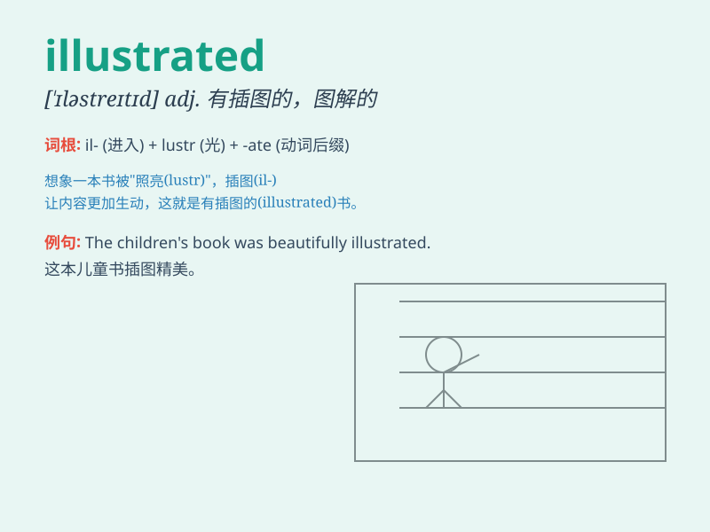

## illustrated

**英音:** _[ɪˈlʌstrɪətɪd]_ **美音:** _[ɪˈlæstrɪt]_

**译义:** *adj.有插图的；用插图说明的；以实例说明的；例证的*

### 短语

+ **illustrated catalogue:** _附有插图的目录_

+ **illustrated book:** _有插图的书_

+ **illustrated magazine:** _有插图的杂志_

+ **be richly illustrated:** _有大量插图_

+ **finely illustrated:** _插图精美的_

### 例句

#### 例句1

> **The book was beautifully illustrated with colorful pictures.**

**中文翻译:** 这本书用色彩鲜艳的图片进行了精美的配图。

**单词释义:** 用图说明；给（书等）做插图

#### 例句2

> **Her story illustrated the power of perseverance.**

**中文翻译:** 她的故事说明了坚持不懈的力量。

**单词释义:** 表明；显示

#### 例句3

> **The data illustrated a clear trend in consumer behavior.**

**中文翻译:** 这些数据显示了消费者行为的一个明显趋势。

**单词释义:** （用示例、图画等）说明

### 背诵小故事

> Once upon a time, there was a poor author. His book had no pictures.
Then an artist came and illustrated it beautifully, making the story
come alive. People loved the illustrated book.

**从前，有一个可怜的作者。他的书没有图片。然后一位艺术家来了，把它精美地作了插图，让故事变得生动起来。人们喜欢这本有插图的书。**

### 图义

