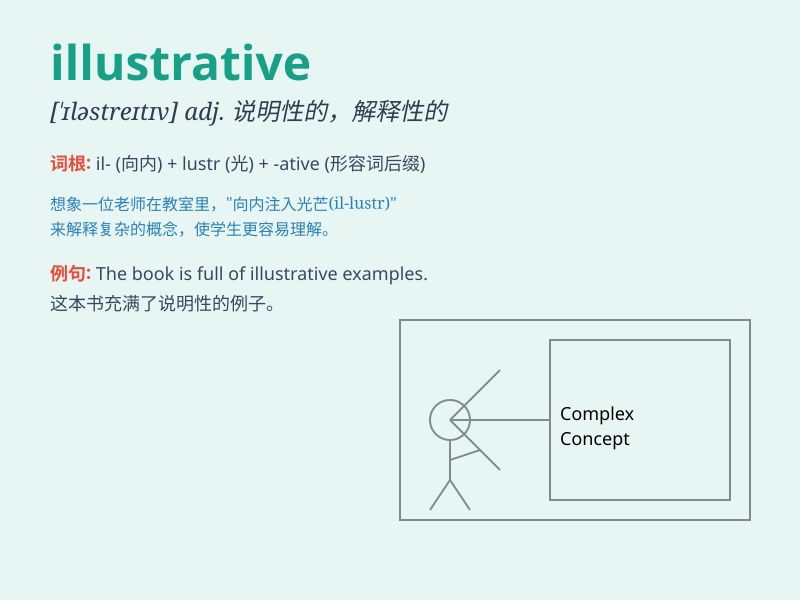

## illustrative

**英音:** _[\'ɪləstrətɪv; ɪ\'lʌst-]_ **美音:**
_[ɪ\'lʌstrətɪv]_

**译义:** *adj.说明性的,例证性的*

### 短语

+ **illustrative example:** _说明性的例子_

+ **illustrative material:** _说明材料_

+ **illustrative diagram:** _说明图_

+ **illustrative story:** _说明性的故事_

+ **illustrative figure:** _说明性的数字；说明性的图形_

### 例句

#### 例句1

> **The diagram is illustrative of the process of photosynthesis.**

**中文翻译:** 这个图表说明了光合作用的过程。

**单词释义:** 说明性的；作例证的

#### 例句2

> **These stories are illustrative of her courage and
determination.**

**中文翻译:** 这些故事表明了她的勇气和决心。

**单词释义:** 表明的；作为例证的

#### 例句3

> **The museum\'s exhibit provides illustrative examples of ancient
art.**

**中文翻译:** 博物馆的展览提供了古代艺术的说明性例子。

**单词释义:** 说明性的；例证性的

### 背诵小故事

> A little artist was always drawing to be illustrative. One day, she
showed her works and everyone understood her ideas clearly. Her pictures
were so illustrative that they told stories without words.

**一位小画家总是通过画画来进行说明。有一天，她展示了自己的作品，每个人都能清晰地理解她的想法。她的画非常具有说明性，无需言语就能讲故事。**

### 图义

