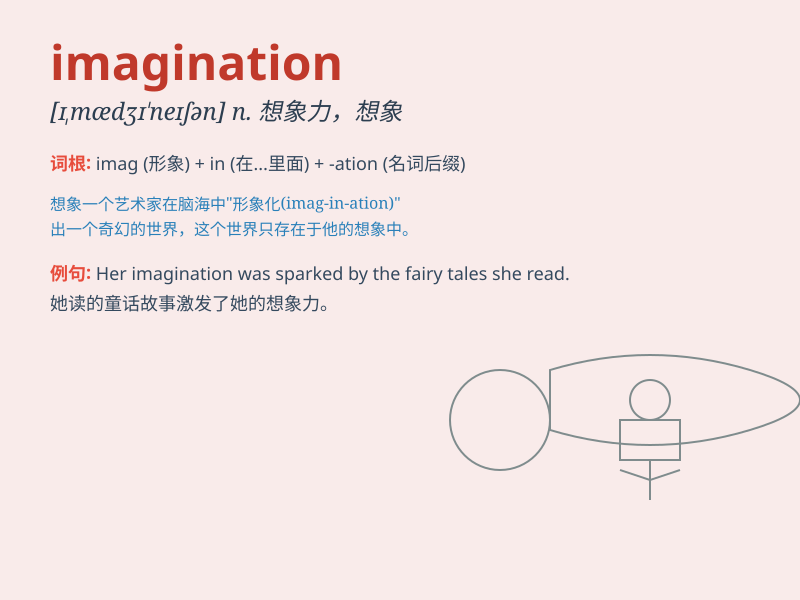

## imagination

**英音:** _[ɪ,mædʒɪ\'neɪʃ(ə)n]_ **美音:**
_[ɪ,mædʒɪ\'neʃən]_

**译义:** *n.想象,空想,想象的事物,想象力,听觉*

### 短语

+ **creative imagination:** _创造性想象力_

+ **wild imagination:** _丰富的想象力；异想天开_

+ **lack of imagination:** _缺乏想象力_

+ **power of imagination:** _想象力；想象的力量_

+ **stimulate imagination:** _激发想象力_

### 例句

#### 例句1

> **His imagination knows no bounds when it comes to designing new
products.**

**中文翻译:** 在设计新产品时，他的想象力是无限的。

**单词释义:** 想象力

#### 例句2

> **The story captured the children\'s imagination.**

**中文翻译:** 这个故事激发了孩子们的想象力。

**单词释义:** 想象力

#### 例句3

> **She has a vivid imagination and often dreams up fantastic
scenarios.**

**中文翻译:** 她想象力丰富，经常幻想出一些奇妙的场景。

**单词释义:** 想象力

### 背诵小故事

> One day, a little boy was alone in his room. With his imagination, he
turned a simple chair into a spaceship and flew to the moon. He saw
strange creatures and beautiful stars. Imagination made his world
wonderful.

**有一天，一个小男孩独自在他的房间里。凭借他的想象力，他把一把简单的椅子变成了一艘宇宙飞船，飞到了月球。他看到了奇怪的生物和美丽的星星。想象力让他的世界变得精彩。**

### 图义

