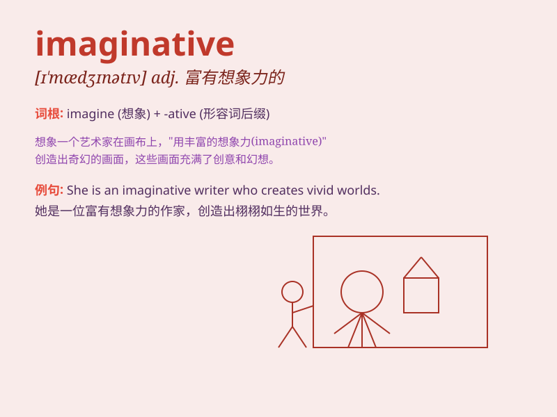

## imaginative

**英音:** _[ɪ\'mædʒɪnətɪv]_ **美音:** _[ɪ\'mædʒɪnətɪv]_

**译义:** *adj.想象的,虚构的*

### 短语

+ **imaginative thinking:** _富有想象力的思维_

+ **imaginative design:** _富有想象力的设计_

+ **imaginative story:** _富有想象力的故事_

+ **imaginative approach:** _富有想象力的方法_

+ **imaginative world:** _富有想象力的世界_

### 例句

#### 例句1

> **The author is highly imaginative and creates wonderful
stories.**

**中文翻译:** 作者想象力丰富，创造了精彩的故事。

**单词释义:** 富有想象力的

#### 例句2

> **She has an imaginative solution to the problem.**

**中文翻译:** 她对这个问题有一个富有想象力的解决方案。

**单词释义:** 富有想象力的

#### 例句3

> **The child\'s drawings are very imaginative.**

**中文翻译:** 孩子的画很有想象力。

**单词释义:** 有想象力的

### 背诵小故事

> Once upon a time, there was a boy named Tom. He was very imaginative.
He could imagine a magical world with flying horses and talking trees.
His imaginative mind made his life full of wonder and adventure.

**从前，有个叫汤姆的男孩。他非常富有想象力。他能想象出一个有飞马和会说话的树的神奇世界。他的想象力让他的生活充满了惊奇和冒险。**

### 图义

