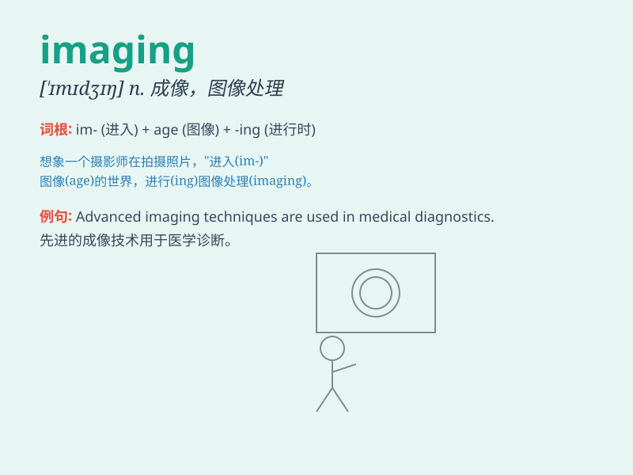

## imaging

**英音:** _[ɪˈmædʒɪŋ]_ **美音:** _[ɪˈmædʒɪŋ]_

**译义:** *n.成像；图像；意象；想象；[医]影像学*

### 短语

+ **medical imaging:** _医学成像_

+ **brain imaging:** _脑成像_

+ **imaging technology:** _成像技术_

+ **optical imaging:** _光学成像_

+ **magnetic resonance imaging (MRI):** _磁共振成像_

### 例句

#### 例句1

> **Medical imaging techniques have advanced significantly in recent
years.**

**中文翻译:** 近年来，医学成像技术有了显著的进步。

**单词释义:** 成像

#### 例句2

> **The imaging of distant galaxies is a challenging task for
astronomers.**

**中文翻译:**
对天文学家来说，遥远星系的成像工作是一项具有挑战性的任务。

**单词释义:** 成像

#### 例句3

> **Imaging software helps us to process and analyze the data.**

**中文翻译:** 成像软件帮助我们处理和分析数据。

**单词释义:** 成像

### 背诵小故事

> One day, a scientist was working in the laboratory, using advanced
equipment for imaging. He was trying to capture clear and detailed
pictures of tiny particles. Through imaging, he hoped to make a great
discovery.

**有一天，一位科学家在实验室工作，使用先进的设备进行成像。他试图捕捉微小粒子清晰详细的图像。通过成像，他希望能有重大发现。**

### 图义

