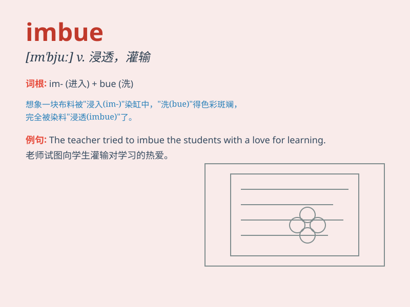

## imbue

**英音:** _[ɪm\'bjuː]_ **美音:** _[ɪm\'bjʊ]_

**译义:** *v.浸透*

### 短语

+ **imbue with:** _使充满；使浸透_

+ **imbue something in:** _将某物灌输于_

+ **imbue deeply:** _深深地浸染_

+ **imbue gradually:** _逐渐灌输_

+ **imbue thoroughly:** _彻底浸透_

### 例句

#### 例句1

> **The teacher\'s enthusiasm imbued the students with a love for
learning.**

**中文翻译:** 老师的热情让学生们充满了学习的热情。

**单词释义:** 使充满，灌输

#### 例句2

> **The artist\'s work is imbued with a sense of mystery.**

**中文翻译:** 艺术家的作品充满了神秘感。

**单词释义:** 充满

#### 例句3

> **Her words imbued him with courage to face the challenge.**

**中文翻译:** 她的话让他充满了面对挑战的勇气。

**单词释义:** 使充满（某种品质或情感）

### 背诵小故事

>
想象一下，一位画家拥有神奇的画笔，每次作画时，他都能将自己对美的独特感受
imbue 到画布上，让每一笔色彩都充满了情感和灵魂。

**想象一位画家把自己对美的独特感受注入到画布上，以此来辅助记忆
imbue（使充满，灌输）这个单词。**

### 图义

