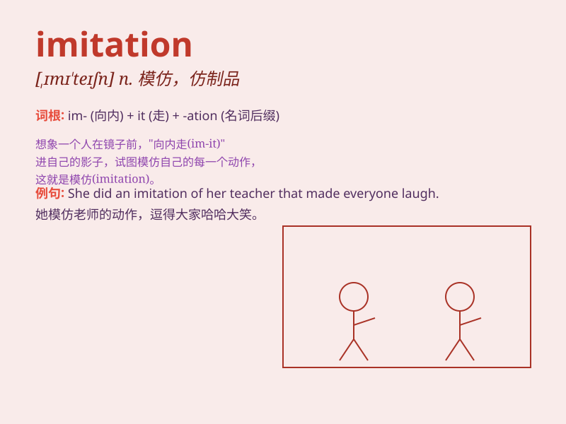

## imitation

**英音:** _[ɪmɪ\'teɪʃ(ə)n]_ **美音:** _[,ɪmɪ\'teʃən]_

**译义:** *n.模仿,效法,冒充,赝品,仿造物*

### 短语

+ **imitation leather:** _人造革_

+ **imitation jewelry:** _仿造珠宝_

+ **in imitation of:** _模仿；仿效_

+ **imitation pearl:** _人造珍珠_

+ **imitation product:** _仿制品_

### 例句

#### 例句1

> **This necklace is a cheap imitation of the real one.**

**中文翻译:** 这条项链是真品的廉价仿制品。

**单词释义:** 仿制品

#### 例句2

> **Her imitation of the singer\'s voice was quite impressive.**

**中文翻译:** 她对歌手声音的模仿令人印象深刻。

**单词释义:** 模仿

#### 例句3

> **The painting is a fine imitation of the master\'s style.**

**中文翻译:** 这幅画是对大师风格的精仿。

**单词释义:** 模仿

### 背诵小故事

> One day, a little monkey saw a human wearing a hat and decided to
make an imitation. It found a similar hat and wore it, thinking it
looked just as cool. But it soon realized it wasn\'t the same as being
truly human.

**一天，一只小猴子看到一个人戴着帽子，决定模仿。它找了一顶相似的帽子戴上，觉得自己看起来也很酷。但很快它就意识到这和真正成为人类是不一样的。**

### 图义

