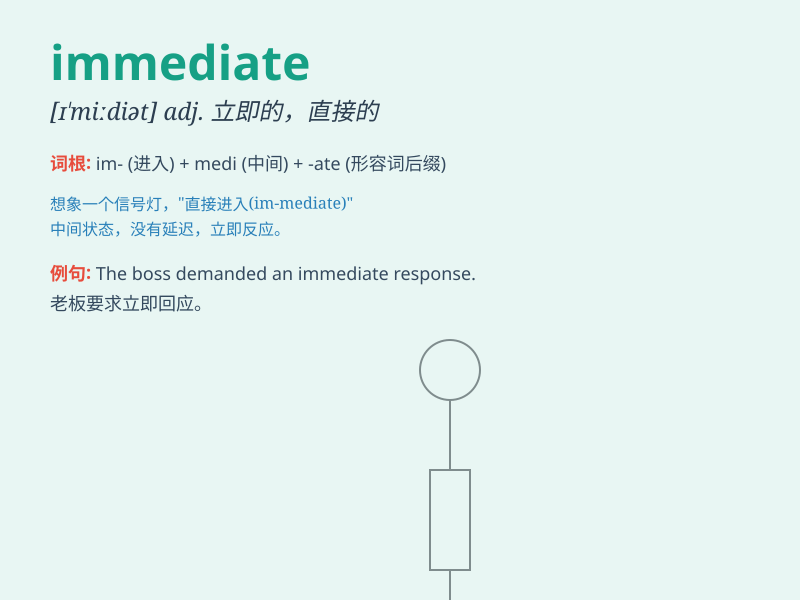

## immediate

**英音:** _[ɪ\'miːdɪət]_ **美音:** _[ɪ\'midɪət]_

**译义:** *adj.直接的,紧接的,紧靠的,立即的,知觉的*

### 短语

+ **immediate family:** _直系亲属_

+ **immediate response:** _即时响应；立即反应_

+ **immediate cause:** _直接原因_

+ **immediate vicinity:** _紧邻；临近地区_

+ **immediate future:** _不久的将来_

### 例句

#### 例句1

> **The immediate cause of the accident was a broken brake.**

**中文翻译:** 造成事故的直接原因是刹车失灵。

**单词释义:** 直接的

#### 例句2

> **I need your immediate attention.**

**中文翻译:** 我需要你立即关注。

**单词释义:** 立刻的；马上的

#### 例句3

> **The immediate effect of the medicine was very obvious.**

**中文翻译:** 药效立竿见影，非常明显。

**单词释义:** 即时的

### 背诵小故事

> A king needed an immediate solution to the enemy\'s attack. His
advisor suggested a bold plan right away. \'Immediate\' means happening
or done without delay, like the king needed a response right then.

**一位国王需要对敌人的进攻立即拿出解决方案。他的顾问马上提出了一个大胆的计划。"immediate"意味着立即发生或完成，就像国王当时需要即刻的回应。**

### 图义

