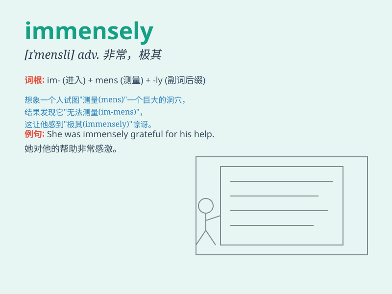

## immensely

**英音:** _[ɪˈmensli]_ **美音:** _[ɪˈmensli]_

**译义:** *adv.无限地,广大地,庞大地,非常*

### 短语

+ **immensely popular:** _极其受欢迎的_

+ **immensely grateful:** _非常感激的_

+ **immensely powerful:** _极其强大的_

+ **immensely successful:** _极其成功的_

+ **immensely talented:** _极具天赋的_

### 例句

#### 例句1

> **I enjoyed the movie immensely.**

**中文翻译:** 我非常喜欢这部电影。

**单词释义:** 非常；极大地

#### 例句2

> **Her talent is immensely valuable to the team.**

**中文翻译:** 她的才华对于团队来说非常有价值。

**单词释义:** 极其；极大地

#### 例句3

> **The new project has benefited the community immensely.**

**中文翻译:** 新项目使社区受益匪浅。

**单词释义:** 极大地；深深地

### 背诵小故事

> A little ant wanted to cross a vast desert. It struggled but finally
made it, realizing the desert was immensely large. But its perseverance
paid off. The ant was happy.

**一只小蚂蚁想要穿过一片广阔的沙漠。它艰难前行但最终成功了，意识到这片沙漠无比巨大。但它的坚持得到了回报，蚂蚁很开心。**

### 图义

