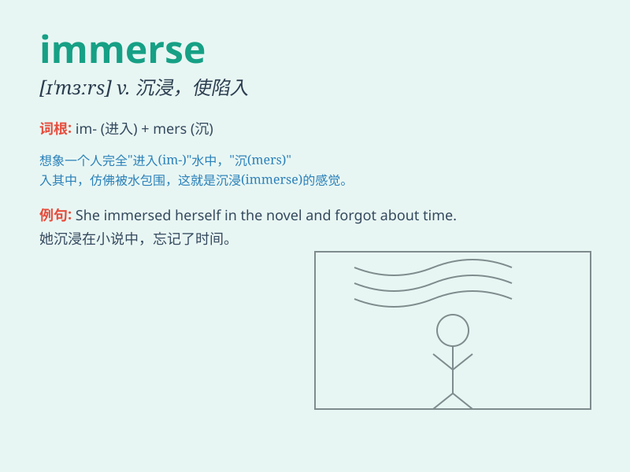

## immerse

**英音:** _[ɪ\'mɜːs]_ **美音:** _[ɪ\'mɝs]_

**译义:** *vt.沉浸,使陷入*

### 短语

+ **immerse oneself in:** _专心于；沉浸于_

+ **be immersed in:** _沉浸在；专心于_

+ **immerse into:** _使浸入；使陷入_

+ **fully immerse:** _完全沉浸_

+ **deeply immerse:** _深深地沉浸_

### 例句

#### 例句1

> **She immersed herself in the book and forgot about the world
around her.**

**中文翻译:** 她沉浸在书里，忘记了周围的世界。

**单词释义:** 使沉浸；使专心于

#### 例句2

> **The artist immerses his brush in the paint before starting to
create.**

**中文翻译:** 艺术家在开始创作之前将画笔浸入颜料中。

**单词释义:** 使浸入

#### 例句3

> **They decided to immerse in the local culture during their
vacation.**

**中文翻译:** 他们决定在假期期间沉浸在当地文化中。

**单词释义:** 使深陷于；使专心于

### 背诵小故事

> A young artist wants to create a masterpiece. So, he decides to
immerse himself completely in his work. He shuts out all distractions
and focuses only on the canvas. Finally, his painting is amazing.

**一位年轻的艺术家想要创作一幅杰作。于是，他决定让自己完全沉浸在工作中。他排除一切干扰，只专注于画布。最终，他的画作令人惊叹。**

### 图义

