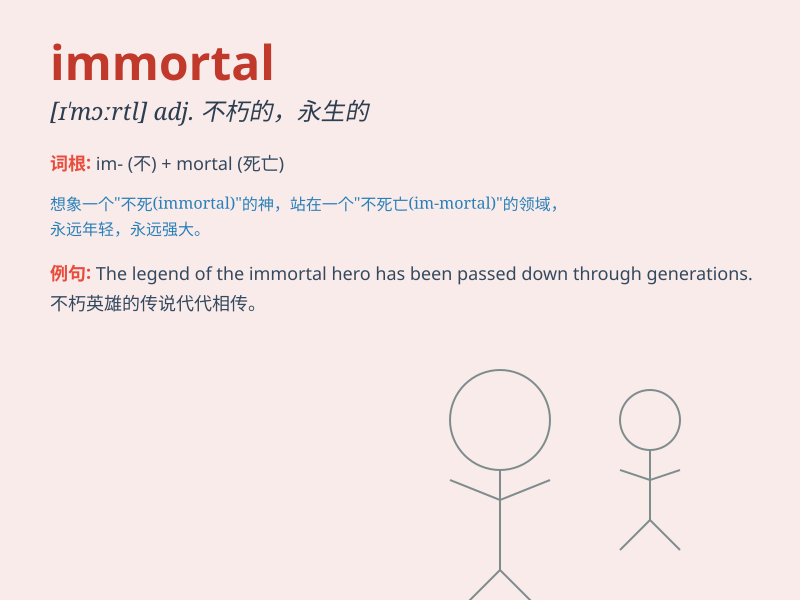

## immortal

**英音:** _[ɪ\'mɔːt(ə)l]_ **美音:** _[ɪ\'mɔrtl]_

**译义:** *adj.不朽的*

### 短语

+ **immortal soul:** _不朽的灵魂_

+ **immortal beauty:** _永恒的美丽_

+ **immortal fame:** _不朽的名声_

+ **immortal works:** _不朽的作品_

+ **immortal legend:** _不朽的传奇_

### 例句

#### 例句1

> **The gods were believed to be immortal in ancient mythology.**

**中文翻译:** 在古代神话中，神被认为是不朽的。

**单词释义:** 不朽的；永生的

#### 例句2

> **His name will live on as an immortal hero.**

**中文翻译:** 他的名字将作为不朽的英雄长存于世。

**单词释义:** 不朽的；永恒的

#### 例句3

> **The poet\'s works are considered immortal masterpieces.**

**中文翻译:** 这位诗人的作品被视为不朽的杰作。

**单词释义:** 不朽的；流芳百世的

### 背诵小故事

> Once upon a time, there was a brave warrior who fought countless
battles. Despite facing many dangers, he never died. People called him
immortal. It means someone who will never die or be forgotten.

**从前，有一位勇敢的战士，历经无数战斗。尽管面临诸多危险，他却从未死去。人们称他为不朽者。这个词意思是永远不会死或被遗忘的人。**

### 图义

