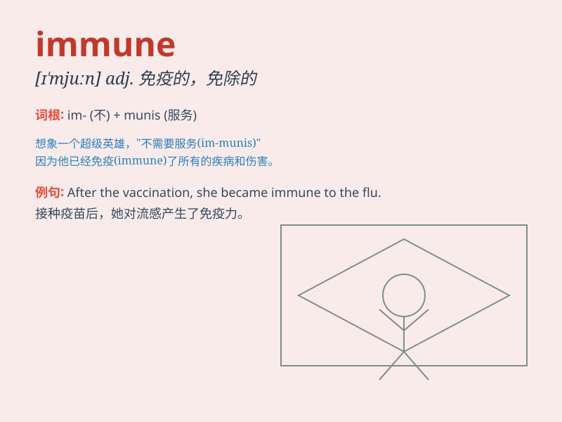

## immune

**英音:** _[ɪ\'mjuːn]_ **美音:** _[ɪ\'mjʊn]_

**译义:** *adj.免疫的*

### 短语

+ **immune system:** _免疫系统_

+ **immune response:** _免疫反应_

+ **be immune to:** _对\...\...免疫；不受\...\...影响_

+ **immune deficiency:** _免疫缺陷_

+ **acquired immune:** _获得性免疫_

### 例句

#### 例句1

> **I\'m immune to smallpox as I\'ve been vaccinated.**

**中文翻译:** 我对天花有免疫力，因为我接种过疫苗。

**单词释义:** 有免疫力的

#### 例句2

> **The law is not immune from criticism.**

**中文翻译:** 这项法律不能免受批评。

**单词释义:** 不受影响的

#### 例句3

> **No one is immune to his charm.**

**中文翻译:** 没有人能不为他的魅力所动。

**单词释义:** 不受......影响的

### 背诵小故事

>
想象一个超级英雄，他的身体具有特殊能力，任何病毒和细菌都无法伤害他。这种不会被侵害的能力就是\'immune\'。就像我们打了疫苗后对某些疾病有了\'immune\'（免疫）能力，不会轻易生病。

**想象超级英雄身体具有不会被病毒细菌侵害的能力来理解\'immune\'（免疫的；不受影响的）**

### 图义

