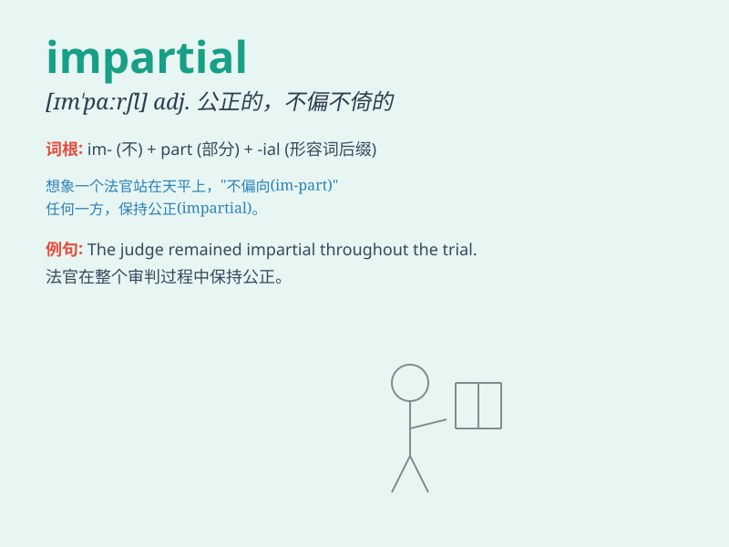

## impartial

**英音:** _[ɪm\'pɑːʃ(ə)l]_ **美音:** _[ɪm\'pɑrʃəl]_

**译义:** *adj.公平的,不偏不倚的*

### 短语

+ **impartial judge:** _公正的法官_

+ **impartial opinion:** _公正的意见_

+ **impartial investigation:** _公正的调查_

+ **impartial observer:** _公正的观察者_

+ **impartial assessment:** _公正的评估_

### 例句

#### 例句1

> **The judge is known for being impartial in all cases.**

**中文翻译:** 这位法官在所有案件中都以公正著称。

**单词释义:** 公正的，不偏不倚的

#### 例句2

> **We need an impartial observer to assess the situation.**

**中文翻译:** 我们需要一个公正的观察者来评估这个情况。

**单词释义:** 公正的，公平的

#### 例句3

> **The impartial report provided a balanced view of the issue.**

**中文翻译:** 这份公正的报告对这个问题提供了一个平衡的观点。

**单词释义:** 不偏不倚的，公正的

### 背诵小故事

> A king needed to judge a dispute. Two people argued fiercely. But the
wise judge was impartial. He listened carefully and made a fair decision
based on facts, not biases. So, impartial means being fair and not
favoring any side.

**一位国王需要裁决一场争端。两人激烈争论。但明智的法官是公正的。他仔细倾听，并依据事实而非偏见做出了公平的决定。所以，impartial
意思是公平的，不偏袒任何一方。**

### 图义

