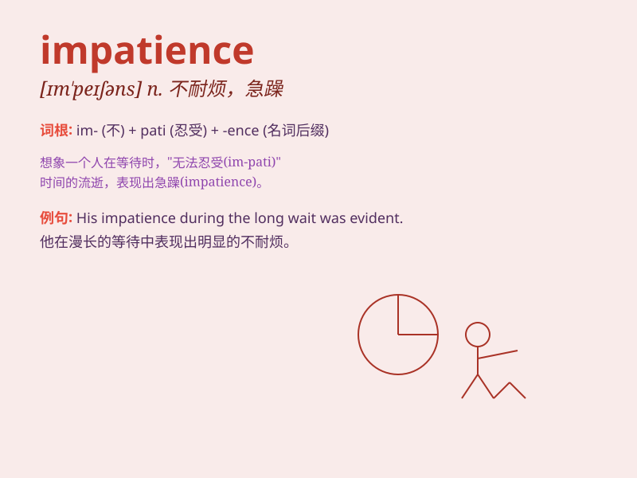

## impatience

**英音:** _[ɪm\'peɪʃns]_ **美音:** _[ɪm\'peʃəns]_

**译义:** *n.急躁*

### 短语

+ **show impatience:** _表现出不耐烦_

+ **impatience with:** _对\...\...不耐烦_

+ **impatience at:** _对\...\...感到不耐烦_

+ **be filled with impatience:** _充满不耐烦_

+ **grow impatient:** _变得不耐烦_

### 例句

#### 例句1

> **His impatience got the better of him and he stormed out of the
room.**

**中文翻译:** 他的不耐烦占据了上风，他冲出了房间。

**单词释义:** 不耐烦

#### 例句2

> **I could sense her impatience as we waited in line.**

**中文翻译:** 当我们排队等候时，我能感觉到她的不耐烦。

**单词释义:** 不耐烦

#### 例句3

> **The driver showed impatience at the traffic jam.**

**中文翻译:** 司机对交通堵塞表现出不耐烦。

**单词释义:** 不耐烦

### 背诵小故事

> Once there was a king. He always got angry quickly when waiting for
his servants. His impatience made everyone around him nervous. Finally,
he realized his problem and tried to change.

**从前有个国王。他在等仆人时总是很快就生气。他的不耐烦让周围的每个人都很紧张。最后，他意识到自己的问题并努力改变。**

### 图义

