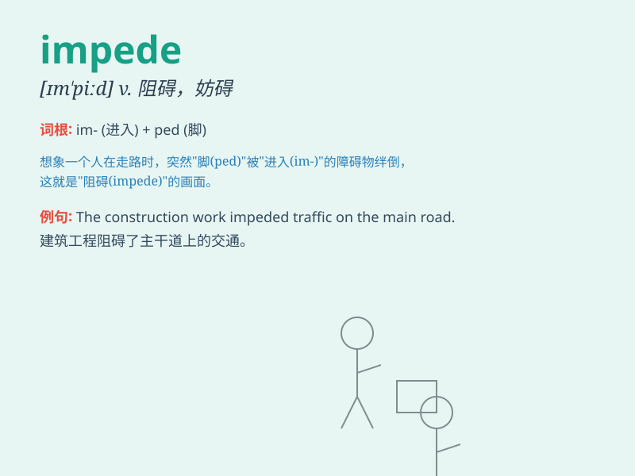

## impede

**英音:** _[ɪm\'piːd]_ **美音:** _[ɪm\'pid]_

**译义:** *v.阻止*

### 短语

+ **impede progress:** _阻碍进展_

+ **impede movement:** _妨碍移动_

+ **impede development:** _阻碍发展_

+ **impede traffic:** _阻碍交通_

+ **impede flow:** _阻碍流动_

### 例句

#### 例句1

> **Heavy snow impeded the progress of rescue work.**

**中文翻译:** 大雪阻碍了救援工作的进展。

**单词释义:** 阻碍

#### 例句2

> **The new regulations may impede economic growth.**

**中文翻译:** 新规定可能会阻碍经济增长。

**单词释义:** 妨碍

#### 例句3

> **Lack of funds severely impeded the project.**

**中文翻译:** 缺乏资金严重阻碍了该项目的实施。

**单词释义:** 阻碍

### 背诵小故事

> A brave knight was on a quest. But a huge fallen tree impeded his
way. He had to use all his strength to move it. Just like obstacles can
impede our progress, this tree stopped the knight.

**一位勇敢的骑士正在执行任务。但一棵巨大的倒下的树挡住了他的路。他不得不使出全身力气去移开它。就像障碍会阻碍我们前进一样，这棵树拦住了骑士。**

### 图义

