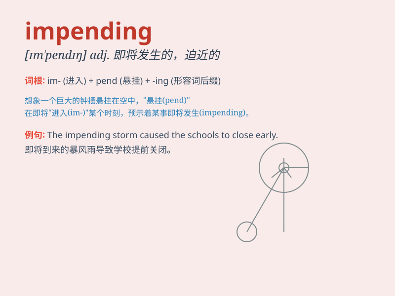

## impending

**英音:** _[ɪm\'pendɪŋ]_ **美音:** _[ɪm\'pɛndɪŋ]_

**译义:** *n.迫近*

### 短语

+ **impending danger:** _即将来临的危险_

+ **impending disaster:** _即将发生的灾难_

+ **impending storm:** _即将来临的暴风雨_

+ **impending event:** _即将发生的事件_

+ **impending deadline:** _即将到来的截止日期_

### 例句

#### 例句1

> **There was a sense of impending disaster as the storm clouds
gathered.**

**中文翻译:** 暴风云聚集，有一种灾难即将来临的感觉。

**单词释义:** 即将发生的；迫在眉睫的

#### 例句2

> **The company is facing impending bankruptcy.**

**中文翻译:** 该公司面临破产即将来临。

**单词释义:** 即将发生的；迫在眉睫的

#### 例句3

> **She could sense the impending exam pressure.**

**中文翻译:** 她能感觉到即将到来的考试压力。

**单词释义:** 即将发生的；迫在眉睫的

### 背诵小故事

> A brave knight was on the battlefield. He sensed the impending danger
when he saw the enemy\'s army approaching in the distance. He prepared
himself for the coming battle.

**一位勇敢的骑士在战场上。当他看到远处敌军逼近时，他感觉到了即将来临的危险。他为即将到来的战斗做好了准备。**

### 图义

