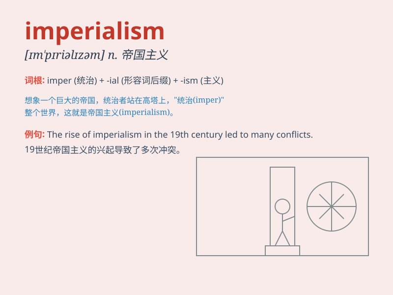

## imperialism

**英音:** _[ɪm\'pɪərɪəlɪz(ə)m]_ **美音:**
_[ɪm\'pɪrɪəlɪzəm]_

**译义:** *n.帝国主义,帝制*

### 短语

+ **colonial imperialism:** _殖民帝国主义_

+ **economic imperialism:** _经济帝国主义_

+ **cultural imperialism:** _文化帝国主义_

+ **new imperialism:** _新帝国主义_

+ **imperialism expansion:** _帝国主义扩张_

### 例句

#### 例句1

> **Imperialism has brought great suffering to many countries.**

**中文翻译:** 帝国主义给许多国家带来了巨大的痛苦。

**单词释义:** 帝国主义

#### 例句2

> **The fight against imperialism is a long and arduous task.**

**中文翻译:** 反对帝国主义的斗争是一项长期而艰巨的任务。

**单词释义:** 帝国主义

#### 例句3

> **He wrote a book criticizing imperialism and colonialism.**

**中文翻译:** 他写了一本书批评帝国主义和殖民主义。

**单词释义:** 帝国主义

### 背诵小故事

> In a faraway land, a powerful king wanted to expand his territory and
control other nations. This aggressive act of seeking dominance and
control was called imperialism. It brought suffering to many.

**在一个遥远的国度，一位强大的国王想要扩张领土并控制其他国家。这种寻求统治和控制的侵略性行为被称为帝国主义。它给许多人带来了痛苦。**

### 图义

