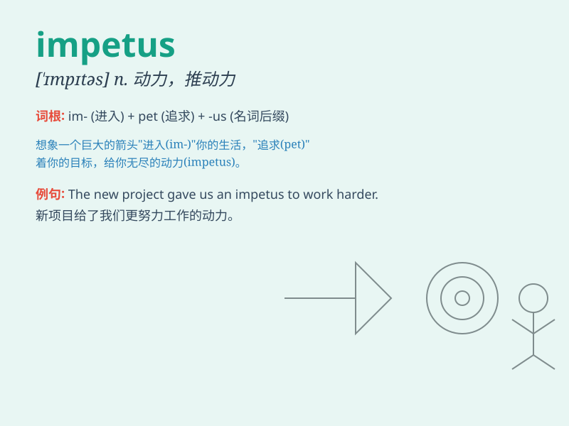

## impetus

**英音:** _[\'ɪmpɪtəs]_ **美音:** _[\'ɪmpɪtəs]_

**译义:** *n.推动力,促进*

### 短语

+ **give an impetus to:** _推动；促进_

+ **gain impetus:** _获得动力_

+ **lose impetus:** _失去动力_

+ **impetus for change:** _变革的推动力_

+ **impetus behind sth:** _某事背后的推动力_

### 例句

#### 例句1

> **The new policy gave an impetus to the development of small
businesses.**

**中文翻译:** 新政策的出台，有力地促进了小微企业的发展。

**单词释义:** 动力

#### 例句2

> **His enthusiasm was the impetus behind the successful project.**

**中文翻译:** 他的热情是项目成功的动力。

**单词释义:** 推动力

#### 例句3

> **The recent economic growth has provided an impetus for
technological innovation.**

**中文翻译:** 近年来的经济增长为技术创新提供了动力。

**单词释义:** 动力

### 背诵小故事

> A young athlete was struggling to improve. One day, a coach\'s
inspiring words gave him the impetus to train harder. With this newfound
motivation, he achieved great success. The impetus was like a powerful
force that pushed him forward.

**一位年轻运动员一直努力提高但成效不佳。一天，教练鼓舞人心的话语给了他动力（impetus）去更努力地训练。有了这新的动力，他取得了巨大成功。动力就像一股强大的力量推动着他前进。**

### 图义

