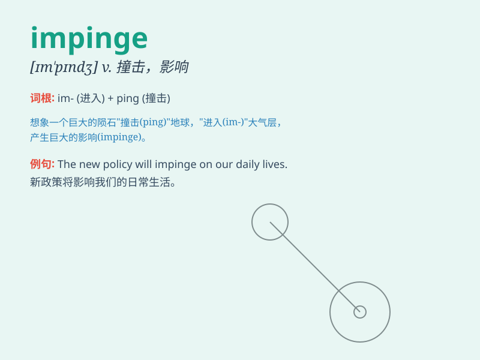

## impinge

**英音:** _[ɪm\'pɪn(d)ʒ]_ **美音:** _[ɪm\'pɪndʒ]_

**译义:** *v.撞击*

### 短语

+ **impinge on:** _影响；撞击；侵犯_

+ **impinge upon:** _对\...产生影响；侵犯_

+ **impinge against:** _碰撞；抵触_

+ **impinge closely:** _紧密接触；紧密影响_

+ **impinge directly:** _直接影响；直接碰撞_

### 例句

#### 例句1

> **The new law will impinge on the rights of citizens.**

**中文翻译:** 新法律将侵犯公民的权利。

**单词释义:** 侵犯；影响

#### 例句2

> **His work impinges on his family life.**

**中文翻译:** 他的工作影响了他的家庭生活。

**单词释义:** 影响；冲击

#### 例句3

> **The branches of the tree impinge upon our roof.**

**中文翻译:** 树枝撞击着我们的屋顶。

**单词释义:** 碰撞；触及

### 背诵小故事

> Imagine a tiny asteroid impinging on a planet. It hits forcefully,
causing a big impact. Just like that, when something impinges, it
strikes or has an effect on something else strongly.

**想象一颗小行星撞击一颗行星。它强力地撞击，造成巨大的冲击。就像这样，当某物
impinge 时，它强烈地撞击或对其他事物产生影响。**

### 图义

