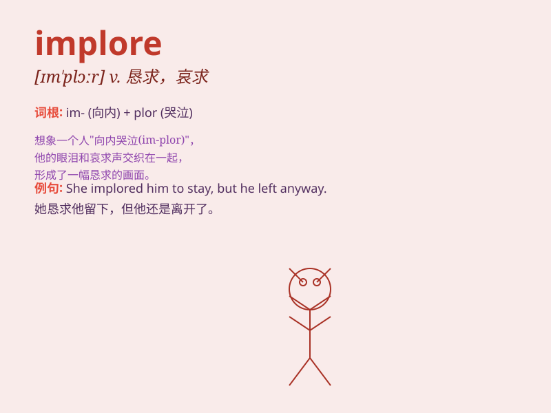

## implore

**英音:** _[ɪm\'plɔː]_ **美音:** _[ɪm\'plɔr]_

**译义:** *vt.恳求,哀求*

### 短语

+ **implore someone to do something:** _恳求某人做某事_

+ **implore for mercy:** _恳求宽恕_

+ **implore help:** _恳求帮助_

+ **implore forgiveness:** _恳求原谅_

+ **implore repeatedly:** _反复恳求_

### 例句

#### 例句1

> **She implored him to stay.**

**中文翻译:** 她恳求他留下来。

**单词释义:** 恳求

#### 例句2

> **He implored her forgiveness.**

**中文翻译:** 他恳求她的原谅。

**单词释义:** 恳求

#### 例句3

> **The child implored his parents for a toy.**

**中文翻译:** 孩子恳求父母给他一个玩具。

**单词释义:** 恳求

### 背诵小故事

> A poor man was in a desperate situation. He implored the rich
merchant for help, begging with tears in his eyes, saying, \'Please have
mercy on me and give me some food.\'

**一个穷人陷入绝境。他恳求富有的商人帮忙，眼中含泪哀求道：'求求您可怜可怜我，给我点食物吧。'**

### 图义

