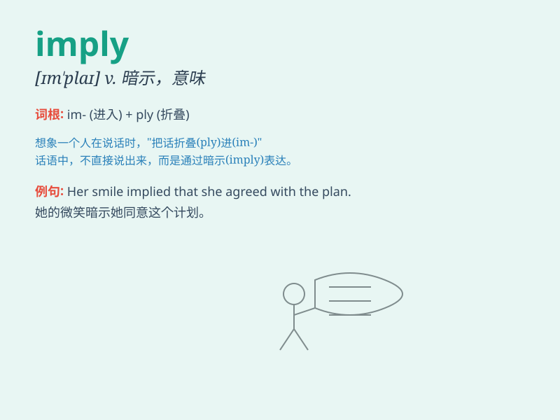

## imply

**英音:** _[ɪm\'plaɪ]_ **美音:** _[ɪm\'plai]_

**译义:** *vt.暗示,意味*

### 短语

+ **imply something:** _暗示某事_

+ **imply that:** _暗示\...\..._

+ **imply a meaning:** _暗示一种意思_

+ **imply intention:** _暗示意图_

+ **imply consequence:** _暗示后果_

### 例句

#### 例句1

> **His silence implies consent.**

**中文翻译:** 他的沉默意味着同意。

**单词释义:** 意味着

#### 例句2

> **What did she imply by that remark?**

**中文翻译:** 她这句话到底想表达什么意思呢？

**单词释义:** 暗示

#### 例句3

> **The evidence implies that he is guilty.**

**中文翻译:** 证据表明他有罪。

**单词释义:** 表明

### 背诵小故事

> A detective was investigating a crime scene. The clues at the scene
imply that the thief entered through the window. But he needed more
evidence to be sure. This shows how imply suggests or indicates
something without stating it directly.

**一位侦探在调查犯罪现场。现场的线索暗示小偷是从窗户进入的。但他还需要更多证据来确定。这表明
imply 是指暗示或表明某事但不直接说明。**

### 图义

