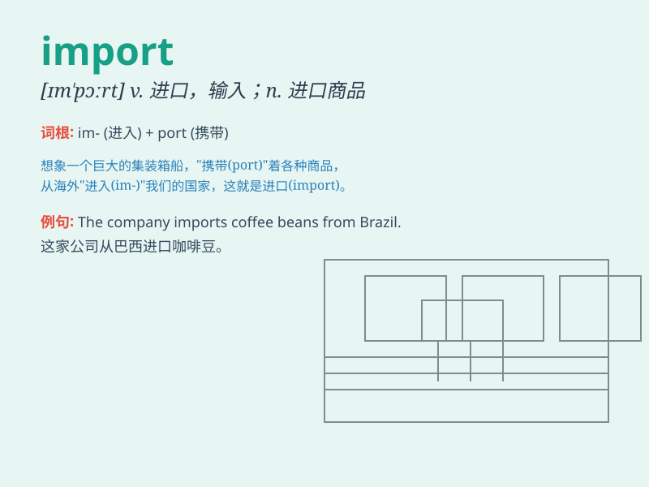

## import

**英音:** _[ɪm\'pɔːt; \'ɪm-]_ **美音:** _[\'ɪmpɔt]_

**译义:**
*n.进口货(常用复数),进口,输入,意思,重要性vt.输入,进口,含\...的意思,重要,引入vi.有关系,有重要性*

### 短语

+ **import duty:** _进口税_

+ **import license:** _进口许可证_

+ **import quota:** _进口配额_

+ **import substitution:** _进口替代_

+ **import and export:** _进出口_

### 例句

#### 例句1

> **The country imports a large quantity of oil every year.**

**中文翻译:** 该国每年进口大量石油。

**单词释义:** 进口

#### 例句2

> **We can import useful knowledge from abroad.**

**中文翻译:** 我们可以从国外引进有用的知识。

**单词释义:** 引进

#### 例句3

> **It is necessary to import advanced technology to improve our
production.**

**中文翻译:** 有必要引进先进技术来提高我们的生产。

**单词释义:** 进口

### 背诵小故事

> 想象一个国家，自己生产的物品不够好，于是从外国 IMPORT
了很多优质的商品。这些商品的 IMPORT 让人们的生活变得更好。

**想象一个国家，自身生产的物品不佳，于是从外国引进了许多优质商品。这些商品的引进让人们的生活得以改善。**

### 图义

