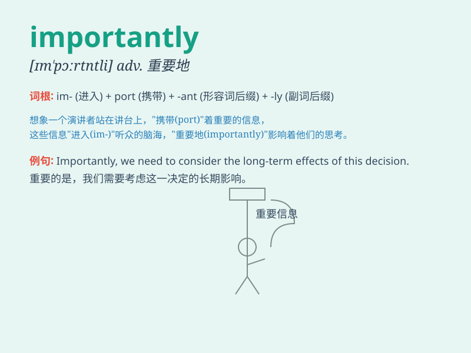

## importantly

**英音:** _[ɪmˈpɔːtntli]_ **美音:** _[ɪmˈpɔːrtntli]_

**译义:** *adv.重要地；要紧地；显著地*

### 短语

+ **most importantly:** _最为重要的是_

+ **importantly enough:** _足够重要的是_

+ **particularly importantly:** _尤其重要地_

+ **significantly importantly:** _显著重要地_

+ **critically importantly:** _极其重要地_

### 例句

#### 例句1

> **Importantly, we need to stay calm in this situation.**

**中文翻译:** 重要的是，在这种情况下我们需要保持冷静。

**单词释义:** 重要地

#### 例句2

> **Importantly, she has the skills required for the job.**

**中文翻译:** 重要的是，她具备这份工作所需的技能。

**单词释义:** 重要地

#### 例句3

> **Importantly, don\'t forget to bring your passport.**

**中文翻译:** 重要的是，别忘了带上你的护照。

**单词释义:** 重要地

### 背诵小故事

> A king was deciding which of two important plans to choose. One
advisor said, \'Importantly, we need to consider the people.\' The king
agreed and made a wise decision. Here, \'importantly\' shows the key
point to think about.

**一位国王正在决定从两个重要的计划中选择哪一个。一位顾问说："重要的是，我们需要考虑人民。"国王同意了并做出了明智的决定。这里，"importantly"表示需要考虑的关键点。**

### 图义

