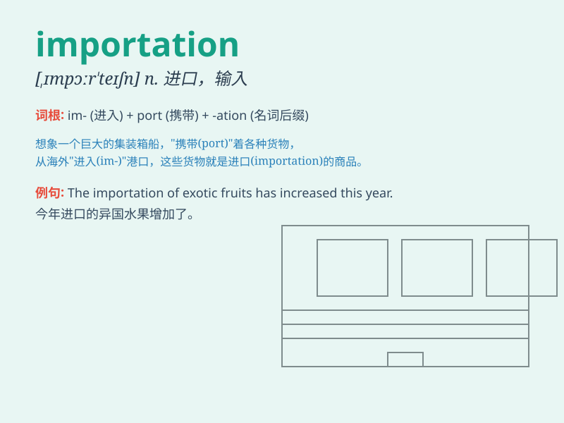

## importation

**英音:** _[ˌɪmpɔːˈteɪʃən]_ **美音:** _[ˌɪmpɔrˈteɪʃən]_

**译义:** *n.进口,输入品*

### 短语

+ **importation duty:** _进口税_

+ **importation ban:** _进口禁令_

+ **importation license:** _进口许可证_

+ **importation quota:** _进口配额_

+ **restrict importation:** _限制进口_

### 例句

#### 例句1

> **The importation of luxury goods has increased significantly in
recent years.**

**中文翻译:** 近年来，奢侈品进口大幅增长。

**单词释义:** 进口

#### 例句2

> **The government is considering restrictions on the importation of
certain agricultural products.**

**中文翻译:** 政府正在考虑限制某些农产品的进口。

**单词释义:** 进口

#### 例句3

> **The importation of illegal drugs is a serious crime.**

**中文翻译:** 进口非法毒品是严重犯罪行为。

**单词释义:** 进口

### 背诵小故事

> A merchant was very excited about the importation of rare jewels. He
traveled far to bring them to his hometown, making a fortune. Remember,
importation means the act of bringing goods or services from another
country.

**一位商人对进口稀有珠宝非常兴奋。他长途跋涉将它们带回自己的家乡，赚了大钱。记住，importation
意思是从另一个国家引进货物或服务的行为。**

### 图义

